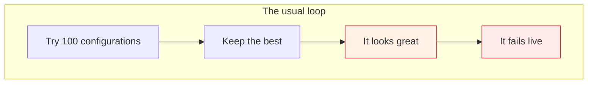
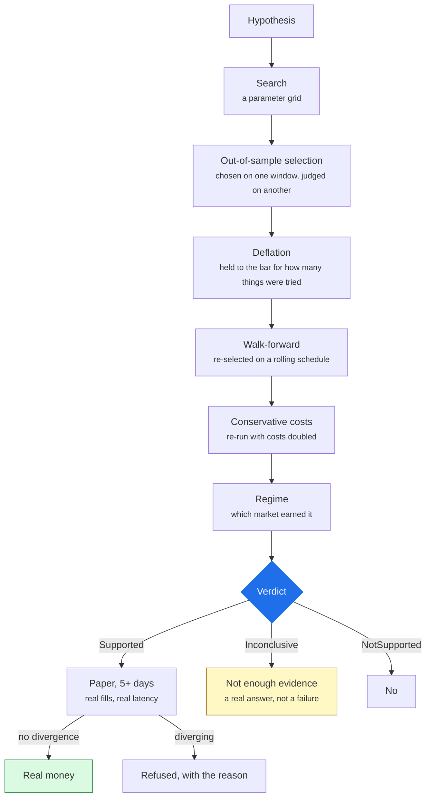

# What Arvo does differently

Most platforms help you find a strategy that worked. Arvo is built on the
assumption that **most things that worked did not work — you just looked at
enough of them.**

> Anything that makes a wrong answer look right outranks anything that adds
> capability.

Everything below follows from that one rule. If you only read one page about why
this exists rather than another backtester, read this one.

## The problem the industry mostly ignores

Run one hundred parameter combinations on one instrument. The best one will look
good. It will look good **whether or not the rule has any edge at all**, because
the best of a hundred coin-flip sequences also looks good.

This is not a subtle statistical point; it is the dominant effect in
quantitative research. And almost every tool in the category is built to help
you do it faster: more indicators, more optimisation, more backtests per second.

## What Arvo does instead

Every claim has to survive a chain of gates. Each one exists because it kills a
specific way of fooling yourself.

### Deflation: the search is counted

If you tried nine configurations, the best of nine has to clear a **higher** bar
than a single guess would — the bar for "best of nine draws from noise". Arvo
computes that bar and reports whether the winner cleared it.

This extends beyond one study. An author's prior searches are pooled: an agent
that runs study after study until one passes is held to the bar for *everything
it has run*, because the winner of twenty studies is the best of a hundred and
eighty draws even when each study was honestly deflated on its own.

Comparing findings is itself a search. `compare_experiments` deflates again —
keeping the best of six is a search of size six.

### `Inconclusive` is a first-class answer

Three verdicts, not two:

| | |
|---|---|
| `Supported` | cleared the bar, out of sample, at conservative costs |
| `NotSupported` | measured, and it does not hold |
| `Inconclusive` | **not enough evidence to say** — too few trades, too short a history, no measurable return |

Most tools have no way to say the third. They report a number, and a number
always looks like an answer. A rule with eleven trades over twenty years has not
been shown to work or to fail; saying so is more useful than a Sharpe ratio
computed from eleven trades.

### Advice comes before the numbers

A finding leads with a plain-language `read_this_first` and a list of advice —
each item a finding, a severity and an action — and the metrics come after.
A `Supported` verdict whose advice says *the average is carried by one
instrument* is not the result it appears to be at a glance, and you should learn
that before you see the return.

### One risk policy, backtest and live

The gate that sized every backtested trade sizes the live ones. Not a
reimplementation that agrees — the same code. So a backtest cannot assume a
position the live account would have refused.

A halt **stays halted** across a restart. A limit a restart lifts is not a limit.

### Fills are measured, not assumed

A backtest assumes a fill at a price. Paper trading on a broker's real endpoint
gives you an actual fill, at an actual spread, with actual latency — so the
difference between the two is a *measurement*. That is why five paper days gate
a live executor, and why the review after the close reports every fill against
the price the rule decided at.

### Data is pinned, not fetched

Bars are fetched to files and pinned by content hash. A study never reads a
vendor live. The same study over the same library gives the same answer next
year, and a finding records which library version produced it — so a result can
be replayed and either reproduces or is reported as diverged.

### Every position can be walked back

Bar → signal → gate → order → fill → position: one chain in the session record,
with the rule that fired, the value it fired on, and the regime it fired in.
Not a log you grep — a record designed to answer "why do I own this?"

## What that costs you

Honest trade-offs, stated:

- **Fewer results will look good.** That is the product working.
- **A hard bar can reject something real.** Deflation is deliberately
  conservative; a genuine but weak edge may come back `Inconclusive`.
- **It is slower to a conclusion** than a platform that reports the best of a
  sweep, because it refuses to report the best of a sweep.
- **The library is yours to keep.** Nothing is fetched during a run, so you fetch
  first.

## What Arvo is not

- **Not a faster backtester.** NautilusTrader is the execution runtime
  underneath; Arvo does not compete with it and exactly one crate is permitted
  to name a Nautilus type. The differentiator is evaluation, not execution.
- **Not a signal service.** There are no recommendations, no shared "best"
  strategies, no marketplace.
- **Not an AI that trades.** An agent writes and tests rules and operates them.
  It holds a token that reaches no order, no credential and no vendor — and a
  test fails the build if a tool is added whose name suggests otherwise.

## Next

[Trading concepts](trading.md) for the vocabulary, or
[the engine on its own](../engine/index.md) to start using it.
