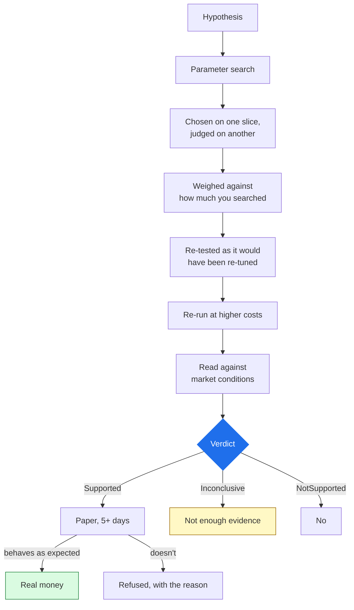

# Why Arvo is different

> Most platforms help you find a strategy that worked. Arvo is built on the
> assumption that most things that worked did not work — you just looked at
> enough of them.

## The problem

The hard part isn't finding a backtest that looks good. It's knowing whether it
looks good because you found a real edge — or because you tried enough
combinations until something looked good.

Run a hundred parameter combinations on one instrument and the best will look
strong. It will look strong **whether or not the rule has any edge at all**,
because the best of a hundred coin-flip sequences also looks strong.

Most tools in this category are built to help you do that faster: more
indicators, more optimisation, more backtests per second. None of them count how
many times you looked.

## What Arvo does instead

Every claim passes a chain of checks. Each one exists because it kills a specific
way of fooling yourself.

### The search is counted

Tried nine configurations? The best of nine must clear a **higher** bar than a
single guess would — the bar for "best of nine draws from noise". Arvo works out
that bar and reports whether the winner beat it.

It extends past one study. Your prior searches are pooled, so running study after
study until one passes does not make it pass. Even *comparing* findings counts:
keeping the best of six is a search of size six.

### "I don't know" is an answer

| Verdict | Means |
|---|---|
| `Supported` | Cleared the bar, out of sample, at higher costs |
| `NotSupported` | Measured, and it does not hold |
| `Inconclusive` | **Not enough evidence to say** — too few trades, too short a history |

Most tools cannot say the third, so they report a number instead. A number always
looks like an answer. A rule with eleven trades over twenty years has not been
shown to work or to fail, and saying so is more useful than a ratio computed from
eleven trades.

### Advice before numbers

A finding leads with plain language and a list of advice — each item a finding, a
severity and an action. Metrics come after. A `Supported` verdict whose advice
says *the average is carried by one instrument* is not the result it looks like,
and you should learn that before you see the return.

### The same risk controls everywhere

The code that sized every backtested trade sizes the real ones — not a
reimplementation that agrees, the same code. A halt stays in force across a
restart.

### Fills are measured

A backtest assumes a fill. Paper trading on a broker's real endpoint gives you an
actual one, at an actual spread, with actual latency — so the difference between
them is a **measurement**. That's why five paper days come before real money.

### Data does not move under you

Bars are fetched to files and pinned by content hash; a study never reads a
vendor live. The same study over the same library gives the same answer next
year, and every finding records which library version produced it.

### Every position walks back

Bar → signal → risk decision → order → fill → position, as one chain, with the
rule and the market conditions on every trade. Not a log you search — a record
built to answer *why do I own this?*

## What it costs you

- **Fewer results will look good.** That is the product working.
- **A genuine but weak edge may come back `Inconclusive`.** The bar is
  deliberately conservative.
- **It is slower to a conclusion** than a tool that reports the best of a sweep,
  because it refuses to report the best of a sweep.
- **You fetch data before you research**, since nothing is fetched during a run.

## What Arvo is not

- **Not a faster backtester.** NautilusTrader is the execution runtime
  underneath. The difference here is evaluation, not execution.
- **Not a signal service.** No recommendations, no shared list of winning
  strategies, no marketplace.
- **Not an AI that trades.** An agent writes and tests rules. It holds no
  credential and has no tool that places an order — enforced by the build, not by
  a prompt.

## Next

[Core concepts](trading.md) for the vocabulary ·
[What you can do](../start/what-you-can-do.md) ·
[Install](../getting-started/install.md)
