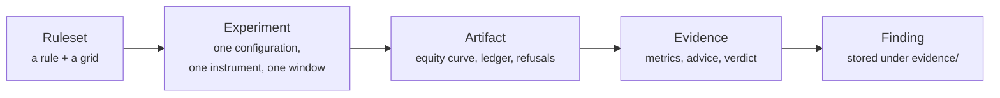

# Trading concepts

The vocabulary Arvo uses, and what each word means *here* — several of these
terms are used loosely elsewhere, and the difference matters when you read a
verdict.

For one-line definitions see the [glossary](../glossary.md). This page explains
why each concept exists.

## Rule, ruleset, strategy

| Word | Means |
|---|---|
| **Rule** | One set of conditions: when to enter, when to exit. `sma_cross` is a rule |
| **Ruleset** | A rule plus a *grid* of parameter values to try. One ruleset is many configurations |
| **Configuration** | One point in that grid — `fast: 10, slow: 30` |
| **Strategy** | Avoided in the interface. It appears in code, the proto contract and findings for historical reasons |

The distinction is load-bearing: a ruleset is a **search**, and how large the
search was determines the bar the winner must clear.

Rules are data — JSON files under `rules/`, using TA-Lib indicator names and
[JSON Logic](https://jsonlogic.com) conditions — so a rule can be written,
shared, diffed and replayed without rebuilding the engine.

## Experiment, finding, evidence

An **experiment** is a full specification: instrument, window, interval, which
library version, which rule with which parameters, which costs, which risk
model, which random seed. Everything needed to run it again.

A **finding** is what got stored: the evidence, the verdict, the advice, and the
experiment that produced it. That is what makes a finding *replayable* — re-run
it and the engine reports `Reproduced` or names the divergence.

## In-sample and out-of-sample

The window is split. Configurations are chosen on the first part **in sample**,
and the chosen one is judged on the second part **out of sample**, which it has
never seen.

Choosing and judging on the same data is the single most common way a backtest
lies. Arvo will not do it — and since the split is recorded in the finding, you
can check where it fell.

## Deflation

The correction for having searched. Given how many configurations were tried,
what would the *best of that many* score if the rule had no edge at all? That
number is the bar, and the winner must clear it.

Reported on every finding as the expected best under the null, alongside whether
it was cleared. A result that beats a single-guess bar but not the best-of-nine
bar is not evidence.

!!! note "Deflation cannot see every bias"
    It corrects for *searching*. It cannot see survivorship bias — a universe of
    today's index members contains only companies that survived, and no search was
    performed to select them, so every gate passes such a result honestly. Knowing
    what a defence does *not* cover is part of using it.

## Walk-forward

Instead of splitting once, re-select on a rolling schedule: choose on a window,
trade the next one, roll forward, repeat. Answers a different question from a
single split — *would this have kept working as it was re-tuned over time* —
rather than *did the one chosen configuration hold up*.

## Conservative costs

Every finding is re-run with costs increased. A rule whose edge is thinner than
its transaction costs is common and looks fine at optimistic costs.

The leaderboard ranks by what survived **conservative** costs first, so a rule
that looks better raw and worse at doubled costs ranks below its neighbour.

## Regime

What kind of market a result was earned in — trending up, trending down, ranging
— labelled after the fact over the closes.

Recorded on every trade. It lets you ask "does this only work in one regime?"
rather than only "did it make money?", which is the difference between an edge
and a bet on conditions continuing.

!!! warning "Regime labels are not causal"
    They are computed over a completed run, so they describe the past with
    hindsight. A rule may *filter* on a signal series only when that series is
    marked causal — computed from data available at that bar. The distinction is
    enforced in the data layer, not left to discipline.

## The risk gate

Every proposed entry passes one gate: it is sized against the account, checked
against limits, and either sized down or refused with a reason. The same gate
runs in the backtest and live.

An **exit never asks the gate** — nothing may stop you shedding risk.

A **refusal is never silent.** It is on the record with its reason, so "why
didn't it take that trade?" is answerable.

## Session, executor, divergence

A **session** is one finding's rule running against one venue, keyed
`<finding>@<executor>`.

An **executor** is where orders go: `alpaca-paper`, `alpaca-live`,
`robinhood-<last4>`.

**Divergence** is the measured difference between what the backtest assumed and
what the venue did — fill prices against decision prices, orders that never
filled. It is why paper trading is a measurement rather than a rehearsal.

A session **freezes** when its book disagrees with the venue: it stops taking
entries and waits for a person, rather than trading on a position it is not sure
it holds.

## Panel

One rule across many instruments, with **one configuration chosen for the whole
panel** — not one per instrument.

Tuning per instrument is a second search: nine configurations over ten
instruments is ninety chances to find something that fits. A panel also pools
evidence, so the trade-count bar becomes reachable honestly instead of by
lowering it, and it makes consistency visible — beating the benchmark on eight
of ten is a different claim from beating it on one by a mile.

!!! note "A panel is not a portfolio backtest"
    Nothing allocates capital across instruments or models the correlation
    between them. Each member is run with the whole account behind it, so the
    pooled drawdown is an average of separate drawdowns and **understates** what a
    real combined position would have suffered. Named rather than quietly
    averaged.

## Universe

A named list of instruments with a **required stated reason**. A file without
one is refused.

A list chosen by looking at what performed well is a search, and an unstated one
is a search nothing counts. Requiring the reason in writing is the cheapest
available defence.

## Promotion

The gate in front of real money: a live executor is refused unless the same
finding has run on paper for at least **five days without diverging** from its
backtest. Days the session took bars on, not days on the calendar.

In the engine, so the command line, the window and an agent are all held to it.

## Next

[What Arvo does differently](index.md) for why these exist, or
[the engine](../engine/index.md) to use them.
