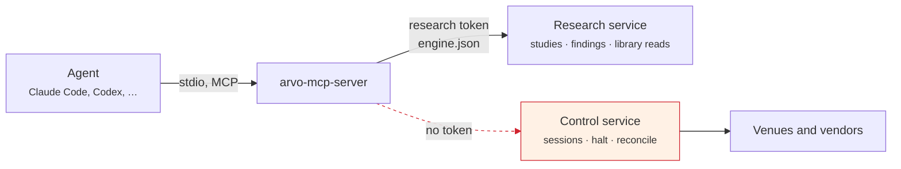

# With Claude Code and other agents

`arvo-mcp-server` is Arvo as an MCP server over stdio. An agent gets the whole
research surface — write a rule, run a study, read the findings — and **cannot
fetch data, reach a broker, place an order or share anything.**

```sh
claude mcp add arvo -- ~/.local/arvo/arvo-mcp-server
```

Then, in Claude Code:

> Run a study of `sma_cross` on MSFT.YF over the last ten years and tell me
> whether the verdict survives conservative costs.

## Say who is running

```sh
claude mcp add arvo -- ~/.local/arvo/arvo-mcp-server --agent claude
```

`--agent <name>` matters more than it looks. Findings are saved under that
author, and **deflated against everything that author has ever run.** An agent
that runs study after study until one comes out `Supported` has performed a
search, and the winner of twenty studies is the best of a hundred and eighty
draws even if each study was honestly deflated against its own nine trials.
Naming the author is what lets the engine hold the whole loop to one bar.

Every run is also appended to `agent-audit.jsonl` in the project, so an
unattended agent leaves a trail you can read afterwards.

## Why it cannot trade

This is structural, not a prompt.



Three things hold the line:

1. **The server holds the research token only.** `control.json` — the token that
   can start a session or halt one — is never given to it.
2. **A test enumerates every offered tool by name** and fails the build if one
   appears containing `fetch`, `order`, `trade`, `share`, `import`, `key` or
   `sign`. Adding a tool that could reach money breaks CI.
3. **The research service has no such call to make.** A parallel test on the
   service itself asserts the same thing from the other side.

!!! note "It reads the library; it does not fill it"
    `query_market_data` returns bars already on disk. Nothing an agent can call
    contacts a vendor, so an agent cannot run up an API bill or change what a
    later study will read.

## The tools

| Tool | What it does |
|---|---|
| `list_strategies` | the rules Arvo ships, and what the project and its extensions offer |
| `list_rules` / `write_rule` | rules as data; write one, refused with the reason when it cannot run |
| `list_rulesets` / `write_ruleset` | parameter grids over a rule |
| `translate_pine` | read a Pine v5 strategy as a rule, refusing what it cannot say **by name** |
| `list_instruments` | what the library holds |
| `list_findings` / `open_finding` | research memory, and one finding in full |
| `run_study` | one rule, one instrument, a search over its parameters, a verdict |
| `run_panel` | one rule across a universe — the same configuration for every member |
| `run_walk_forward` | re-select on a rolling schedule instead of splitting once |
| `query_market_data` | bars for an instrument over a window, at most 2000 from the end |
| `inspect_regime` | the regime each bar closed in, labelled after the fact |
| `rank_findings` | the leaderboard, in the one order |
| `compare_experiments` | findings read against each other — **then deflated again**, because keeping the best of six is a search of size six |
| `read_review` | what every session and every person did on a day, as one report |

## How it finds the engine

It reads `engine.json` in the app data directory. If no engine is running it
starts one — from `ARVO_ENGINE`, or `arvo-engine` beside itself — and that
engine **keeps running after the agent's session ends**, so a study you asked
for at midnight is still there in the morning.

To point an agent at a specific project rather than the app data directory,
give it the folder:

```sh
claude mcp add arvo -- ~/.local/arvo/arvo-mcp-server ~/arvo --agent claude
```

## Other clients

Any MCP client works the same way — the server names no vendor and assumes no
particular agent.

=== "Claude Code"

    ```sh
    claude mcp add arvo -- ~/.local/arvo/arvo-mcp-server --agent claude
    ```

=== "Codex / generic MCP"

    ```json
    {
      "mcpServers": {
        "arvo": {
          "command": "/home/you/.local/arvo/arvo-mcp-server",
          "args": ["/home/you/arvo", "--agent", "codex"]
        }
      }
    }
    ```

The window's Agent panel is this same server attached over the Agent Client
Protocol, so an agent sees exactly the same tools inside Arvo and outside it.

## What an agent is for, and what it is not

The agent's job is to **write and test the rules that trade, and to operate
them** — not to place trades of its own. Starting a session is a person's
decision, made with the control token, and promotion to real money needs five
paper days on the record regardless of who asks.

The [arvo-skills plugin](skills.md) teaches the agent how to use these tools
the way Arvo means them — verdict before number, every run a search.

[Where this is going →](../about/horizon.md)
