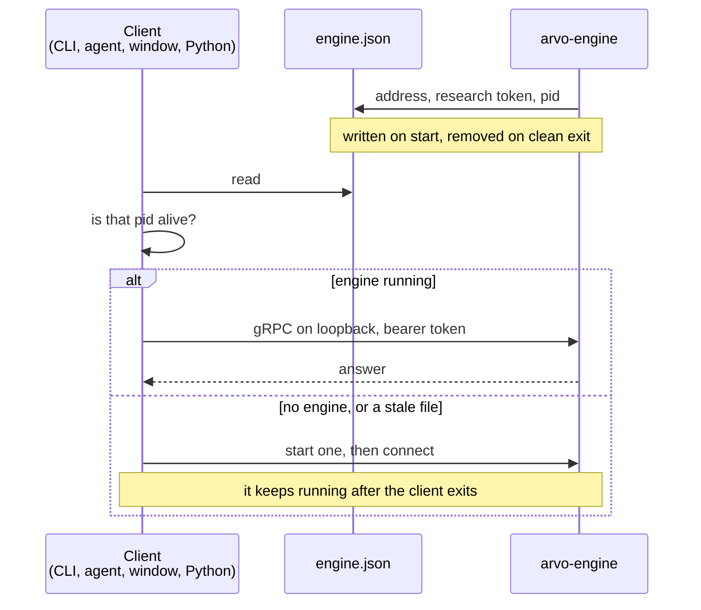

# Configure the engine

The engine has no configuration file of its own. What it reads is a **project
folder** you point it at, and what it writes are two small handshake files so
clients can find it. There is nothing to set up before the first run.

```sh
arvo-engine ~/arvo      # serve this project
arvo-engine             # serve the app data directory instead
```

## The project folder

One folder is one body of research: its own library, its own findings, its own
rulesets. Run two engines on two folders and they share nothing but the
keychain.

```
~/arvo/
├── data/            the bar library — CSV per instrument, pinned by content hash
│   ├── SPY.YF.csv
│   ├── 5minute/
│   └── 1minute/
├── evidence/        findings, one JSON file each, plus index.json (a cache)
├── rules/           rules as data (#225), one JSON file each
├── rulesets/        parameter grids over a rule
├── universes/       instrument lists, each with a stated reason
├── option-quotes/   recorded chains — a folder per SYMBOL.feed, a file per day
├── sessions/        session records, one JSON line per event
├── reviews/         the report written after each close
├── portfolios/      holdings imported from a statement
├── snapshots/
├── engine.json      written by the engine: address, research token, pid
└── control.json     written by the engine: the control token
```

Everything in it is a plain file you can read, diff and commit. Nothing is a
database you need the engine to open.

!!! warning "`data/` and `evidence/` cannot always be rebuilt"
    Bars can be refetched. **Option chains cannot** — no vendor serves a
    historical quote for a contract, so a chain not recorded on the day is gone
    for good. Back up `option-quotes/` like source code.

## How a client finds the engine

The engine writes its own handshake, then every client reads it. There is no
port to configure and no service to register.



`engine.json` holds the address (loopback, plain HTTP/2 — nothing leaves the
machine), a 64-character hex research token, and the engine's pid so a file left
behind by a crash can be told from a live one.

## Two tokens, and why

`control.json` holds a second token. The split is the point:

| Token | Written to | Reaches |
|---|---|---|
| Research | `engine.json` | studies, findings, the library, reviews — everything that reads or computes |
| Control | `control.json` | starting and stopping sessions, halting, reconciling, stopping the engine |

An agent is given `engine.json` and nothing else, so **an agent holding the
research token cannot start a session, place an order or halt one.** That is
enforced in the engine and covered by tests named for it
(`the_research_token_cannot_reach_a_session`,
`only_the_control_token_can_stop_the_engine`).

!!! danger "Treat `control.json` as a credential"
    Anything that can read it can flatten your account. It lives in the project
    folder — so do not commit a project folder to a shared repository, and do
    not put one in a synced directory that other machines can read.

## Environment

| Variable | Read by | Meaning |
|---|---|---|
| `ARVO_ENGINE` | `arvo-mcp-server`, the window | Path to the `arvo-engine` binary to start when none is running |
| `RAYON_NUM_THREADS` | the engine | Cap the cores research uses. Unset means all of them |
| `RUST_LOG` | the engine | `RUST_LOG=info` or `debug` for diagnostics on stderr |

Nothing else is read from the environment. Credentials never are — they live in
the operating system keychain, and the engine is the only process that asks for
them. See [Accounts and credentials](../getting-started/accounts.md).

## The app data directory

When you give no project folder, the engine serves this one:

| | |
|---|---|
| Windows | `%APPDATA%\com.arvo.desktop` |
| macOS | `~/Library/Application Support/com.arvo.desktop` |
| Linux | `~/.local/share/com.arvo.desktop` |

It holds the same layout as any project folder, plus the window's own
`settings.json`, `keybindings.json` and extensions when a window is installed.
Using the engine alone, you will more often want an explicit folder.

## What the engine does on a schedule

Left running, it fetches what the project's universes ask for and records option
chains for the underlyings named in `option-quotes/underlyings.json`. Both are
files you write; neither happens unless you ask.

```json title="option-quotes/underlyings.json"
{
  "reason": "The most liquid US option markets: tight spreads and daily or weekly expiries.",
  "underlyings": [
    { "symbol": "SPY", "why": "the deepest option book there is; daily expiries" },
    { "symbol": "QQQ", "why": "the same for the Nasdaq 100" }
  ]
}
```

The `reason` is required, and a file without one is refused. A list of
instruments chosen by looking at what did well is itself a search, and the
platform exists to deflate searches — so it insists you say out loud why the
list is what it is. [Universes →](../features/universes.md)

## Next

[The command line](cli.md), verb by verb.
