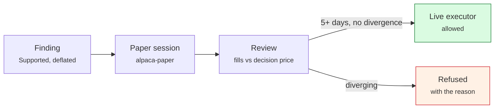

# Examples

End-to-end runs using the engine alone. No window, no screenshots — copy,
paste, read the output.

!!! note "Where research is actually driven from"
    The command line does sessions, reviews, the leaderboard, universes and Pine
    import. It has **no `study` verb**. A study is started from the Python
    package, from an agent over MCP, or from the window — because a study takes
    arguments that want names, and a terminal is the wrong place to type a
    parameter grid. The CLI is for operating what research produced.

## 1. A first study, from a cold start

```sh
mkdir -p ~/arvo && arvo-engine ~/arvo     # leave it running
```

In a second terminal:

```sh
pip install arvo-client
```

```python title="first_look.py"
import arvo

engine = arvo.connect()                 # reads engine.json
found = engine.run_study("AAPL.RH", "sma_cross", author="script:first-look")

# These three, before any number.
print(found.verdict)                    # Supported | NotSupported | Inconclusive
print(found.read_this_first)
for item in found.advice:
    print(f"  [{item.severity}] {item.finding} -> {item.action}")
```

**`author` is required.** The run is saved under that name and deflated against
everything that author has run, so a script that loops until something passes
does not thereby make it pass.

A first run on an empty library will tell you the instrument is unknown — the
library is filled from universes, which is the next example.

## 2. Fill the library, then test breadth

A single instrument cannot conclude much: a moving-average crossover trades ten
to twenty times in twenty years, and thirty round trips is roughly the minimum
for a mean to mean anything. Breadth is the answer.

```json title="~/arvo/universes/etf30.json"
{
  "name": "etf30",
  "reason": "The most liquid US ETFs across equity, bond, sector and commodity exposure: tight spreads and long histories.",
  "interval": { "step": 1, "unit": "day" },
  "since": "2016-01-01",
  "instruments": ["SPY.YF", "QQQ.YF", "IWM.YF", "DIA.YF", "VTI.YF", "GLD.YF", "TLT.YF", "XLF.YF", "XLE.YF", "XLK.YF"]
}
```

```sh
arvo-engine ~/arvo universes            # what is missing
arvo-engine ~/arvo universes refresh    # fetch it
```

```python title="panel.py"
import arvo

engine = arvo.connect()
found = engine.run_panel("etf30", author="script:panel", strategy="sma_cross")

print(found.verdict, found.read_this_first)
print("members beating buy-and-hold:", found.beat_benchmark, "of", found.instruments)
```

One configuration is chosen for the **whole panel**, not one per instrument —
tuning per instrument is a second search, and nine configurations over ten
instruments is ninety chances to find something that fits.

!!! warning "A panel over an index universe is testing survivors"
    Membership is read as it stands today, so an S&P 100 panel over 2010–2026
    tests the companies still in the index at the end. That bias is not a
    multiple-testing problem, so deflation cannot see it. Treat such a result as
    optimistic until point-in-time membership lands
    ([#235](https://github.com/wjpin84/arvo-desktop/issues/235)).

## 3. Read the leaderboard

```sh
arvo-engine ~/arvo rank
```

The order is not by return. Findings that survived **conservative costs** come
first, then those `Supported` only at stated costs, then the rest — ties broken
by drawdown, then trade count. A rule that looks better raw and worse at doubled
costs ranks below its neighbour on purpose.

## 4. Import a TradingView strategy

```sh
arvo-engine ~/arvo pine ~/Downloads/twin_cross.pine --interval 1day
```

It prints the translation and **names everything it refused** rather than
approximating it. When you are satisfied it says what the original said:

```sh
arvo-engine ~/arvo pine ~/Downloads/twin_cross.pine --interval 1day --keep
```

The rule lands under `rules/`, with the source recorded beside it, and is then a
rule like any other — deflated, walked forward, costed.

## 5. Put a finding on paper

```sh
arvo-engine ~/arvo session start <finding> alpaca-paper
arvo-engine ~/arvo session list
```

Alpaca's paper endpoint is a real API with real fills and real latency, so its
divergence from the backtest is a measurement rather than an assumption. Watch
it for five sessions; that is also the minimum before a live executor is allowed.

```sh
arvo-engine ~/arvo review               # after the close
```



## 6. Ask an agent to do the above

```sh
claude mcp add arvo -- ~/.local/arvo/arvo-mcp-server ~/arvo --agent claude
```

> Read the leaderboard, take the top finding, and tell me whether its advice
> mentions anything I should worry about before paper trading it.

The agent can run the research and read every finding. It cannot start the paper
session — that is a person's decision, made with the control token.
[With Claude Code →](claude.md)

## 7. Explain a position after the fact

```sh
arvo-engine ~/arvo session explain twin_cross@alpaca-paper 2026-09-25T14:35:00
```

Bar → signal → gate → order → fill → position, for everything held at that
instant, with the rule that fired, the value it fired on, and the regime. Needs
no running engine: it reads the record on disk.

## 8. Stop everything

```sh
arvo-engine ~/arvo session halt --all "stepping away"
```

Arms the gate, flattens what it can, and stays halted — a restart does not lift
it. **Read the output**: if the venue refused an exit, the halt names the
instrument rather than reporting success, and that position is still yours.
