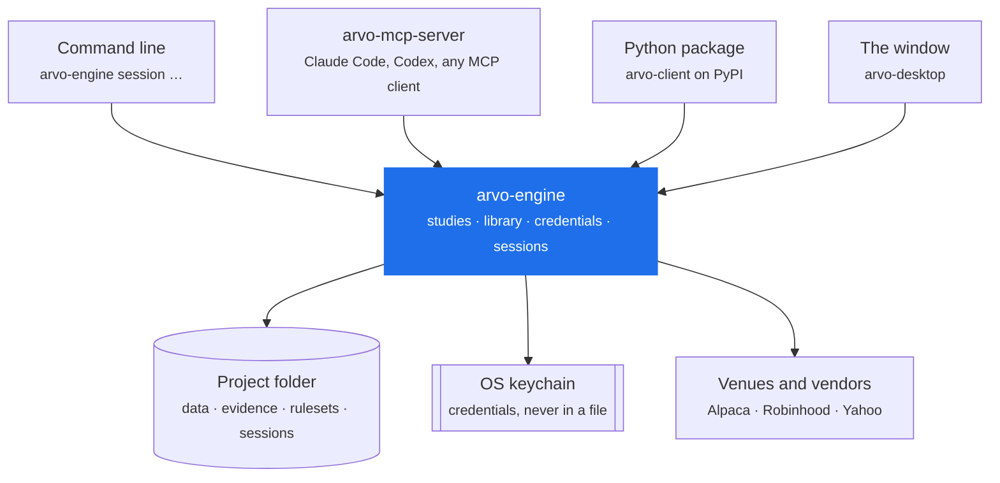

# The engine on its own

`arvo-engine` is the whole of Arvo except the window. It runs studies, keeps
the data library, holds credentials, hosts live sessions and serves a local
API — and it is a complete tool by itself. The desktop window is one client of
that API, not the product.

If you already work in a terminal, an editor, or an agent, you may never need
the window.

## What it gives you without a GUI

- **Research with a verdict**

    Run a study over a parameter search, selected out of sample and deflated
    against how many things were tried. The answer is `Supported`,
    `NotSupported` or `Inconclusive`, with advice you read before any number.
    [Concepts →](../concepts/index.md)

- **A pinned data library**

    Bars are fetched to files and pinned by content hash. A study never reads
    a vendor live, so the same study over the same library gives the same
    answer next year. [Configure →](configure.md)

- **Live and paper sessions**

    A finding's rule runs against a venue, audits its book against the broker
    every poll, freezes on a disagreement and waits for you. One kill switch.
    [Command line →](cli.md)

- **An agent surface that cannot trade**

    `arvo-mcp-server` exposes research over MCP. No tool names a credential, a
    source or an order. [With Claude Code →](claude.md)

## The four clients

Everything talks to one engine per user, over gRPC on loopback, behind a token
the engine writes to `engine.json`.

The engine outlives every one of them. Close the window, end the agent's
session, log out of the terminal — a schedule still runs and a live session
still trades. That is a decision, not an accident:
[ADR-0018](https://github.com/wjpin84/arvo-adrs/blob/main/0018-arvo-keeps-running-when-the-window-closes.md).

## Two boundaries worth knowing before you start

**The agent surface cannot reach money.** `arvo-mcp-server` holds a token for
the research service alone. A test in the engine enumerates every offered tool
by name and fails the build if one appears whose name contains `Fetch`,
`Order`, `Trade`, `Share`, `Import`, `Key`, `Sign`, `Session` or `Halt`. The
guarantee is structural, not a policy in a prompt.

**Real money needs a paper record first.** A live executor is refused unless
the same finding has run on paper for at least five days without diverging from
its backtest. The gate is in the engine, so the CLI, the window and an agent
are all held to it.

## Where to go next

| | |
|---|---|
| Install it, verify it, remove it | [Install](install.md) |
| The project folder, `engine.json`, tokens, environment | [Configure](configure.md) |
| Every verb, with worked examples | [Command line](cli.md) |
| Attach it to Claude Code | [With Claude Code](claude.md) |
| Drive it from an editor and a terminal | [With VS Code](vscode.md) |
| End-to-end runs you can copy | [Examples](examples.md) |
