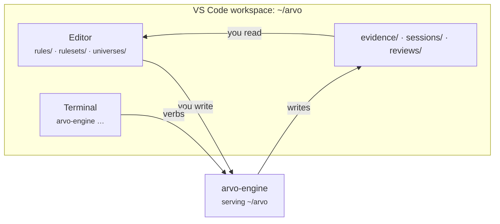

# With VS Code

Arvo's own window is a separate application, and one day it may replace this
workflow. Until then the engine sits behind a terminal and a folder of plain
files, which is exactly what an editor is good at.

There is no Arvo extension for VS Code. You do not need one — the project is
JSON files and the engine is a command.

## The setup

Open the project folder as the workspace:

```sh
code ~/arvo
```

Everything you edit is a file in it: `rules/`, `rulesets/`, `universes/`,
`option-quotes/underlyings.json`. Everything the engine produces is a file too:
`evidence/`, `sessions/`, `reviews/`. Editing and reading are ordinary editor
work.



## Keep the engine in a terminal

Run it in a dedicated VS Code terminal so you can see what it is doing:

```sh
arvo-engine ~/arvo
```

Leave it. Use a second terminal for verbs. The engine outlives the editor — if
you close VS Code with a session running, the session keeps trading, which is
the intended behaviour and worth being deliberate about.

## Schema help while editing

The project's JSON files have a shape, and the engine refuses a bad one with a
reason. To get completion and errors *while typing* instead, point VS Code at
the shape with a `settings.json` in the workspace:

```json title=".vscode/settings.json"
{
  "files.associations": {
    "**/rules/*.json": "jsonc",
    "**/rulesets/*.json": "jsonc",
    "**/universes/*.json": "jsonc"
  },
  "files.exclude": {
    "**/engine.json": true,
    "**/control.json": true
  }
}
```

!!! danger "Hide `control.json`, and never commit it"
    It holds the token that can flatten your account. Excluding it from the
    explorer keeps it out of screenshots and out of the way; a `.gitignore` entry
    keeps it out of history.

```gitignore title=".gitignore"
engine.json
control.json
data/
```

`data/` is excluded because it is large and refetchable. **Do not exclude
`evidence/` or `option-quotes/`** — findings are your research history, and a
recorded option chain cannot be fetched again after the day it was recorded.

## Tasks for the verbs you run most

```json title=".vscode/tasks.json"
{
  "version": "2.0.0",
  "tasks": [
    {
      "label": "Arvo: serve",
      "type": "shell",
      "command": "arvo-engine ${workspaceFolder}",
      "isBackground": true,
      "problemMatcher": []
    },
    {
      "label": "Arvo: leaderboard",
      "type": "shell",
      "command": "arvo-engine ${workspaceFolder} rank",
      "problemMatcher": []
    },
    {
      "label": "Arvo: review today",
      "type": "shell",
      "command": "arvo-engine ${workspaceFolder} review",
      "problemMatcher": []
    },
    {
      "label": "Arvo: sessions",
      "type": "shell",
      "command": "arvo-engine ${workspaceFolder} session list",
      "problemMatcher": []
    }
  ]
}
```

Deliberately absent: a task that starts a session or halts one. Both are
decisions, and a decision does not belong behind a key you might hit by
accident.

## Claude Code in the same window

Claude Code's VS Code extension and the MCP server compose without any extra
work — the agent gets Arvo's research tools in the editor you are already in.

```sh
claude mcp add arvo -- ~/.local/arvo/arvo-mcp-server ~/arvo --agent claude
```

The agent reads and writes the same files you have open, so a ruleset it writes
appears in the explorer and a finding it produces appears under `evidence/`.
It still cannot trade. [With Claude Code →](claude.md)

## Reading a finding

A finding is one JSON file, written to be read:

```sh
code ~/arvo/evidence/*.json
```

Read the `advice` and the `verdict` **before** any number — that ordering is the
whole design. A `Supported` verdict with advice saying the average is carried by
one instrument is not the result it looks like at a glance.
[Verdicts and advice →](../reference/verdicts.md)
