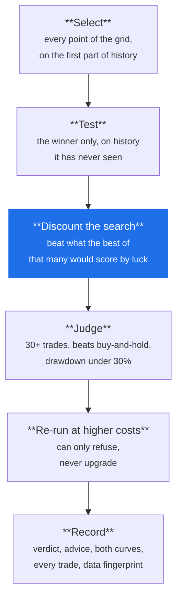

# Research

**You get an answer you can weigh, not a number you have to trust.**

Run a study and Arvo comes back with a *finding*: a verdict, plain-language
advice, and the evidence behind both. The verdict can be `Supported`,
`NotSupported`, or `Inconclusive` — and that third one is the point. A rule with
too few trades has not been shown to work *or* to fail, and Arvo says so instead
of reporting a ratio that looks like an answer.

A **study** is the unit: one rule, one instrument, a search over the rule's
parameters. It runs in the engine on bars from the project's library, and is
stored as a finding you can reopen, replay, compare and export.

## What happens when you run one



Each step in detail:

1. **Selects on the first part of history.** The rule runs over every point of
   the search grid, in sample.
2. **Tests on history it never saw.** Only the selected configuration, on the
   held-out window. These are the only numbers reported as the result.
3. **Discounts the search.** The best in-sample result is judged against what the
   best of *that many* random trials would have shown. A grid of forty tries that
   beats forty coin flips by nothing is nothing.
4. **Judges it.** Against the criteria — at least 30 trades, a positive excess
   return over buying and holding the instrument, a drawdown under 30%.
5. **Checks whether the costs made it.** Anything that would be `Supported` is run
   again at conservative costs: half again the commission, twice the slippage and
   never under five basis points, twice the fees, twice an option's spread. If it
   fails there the finding is refused, and the advice says it first — the edge was
   the cost assumption's, not the rule's. This step **can only refuse, never
   upgrade**.
6. **Records everything.** The verdict, the advice, both curves, the trade ledger
   with what the rule saw on each trade, the data's content hash, the ruleset's
   hash and the engine's commit — so a finding knows when it has gone **stale**
   because its data or its ruleset changed underneath it.

## Kinds of study

| Kind | Question |
|---|---|
| **Study** | Does this rule, over this search, beat holding the instrument out of sample? |
| **Walk-forward** | Does the selection hold up when the window rolls forward, re-selecting each step? |
| **Panel** | The same rule over many instruments at once, one parameter set: does it hold across names? |
| **Book** | Many instruments, one account, one gate: what does the portfolio do, and which members were silent? |
| **Reported** | Evidence a script computed elsewhere, submitted with its curve and ledger; Arvo computes the verdict, never the submitter |

## Verdicts

<span class="arvo-verdict-supported">Supported</span> — beat the benchmark
by the margin, within the risk ceiling, on enough trades to be worth
reading. <span class="arvo-verdict-notsupported">NotSupported</span> — ran
cleanly and did not clear the bar. <span class="arvo-verdict-inconclusive">Inconclusive</span>
— the run cannot answer either way: too few trades, too short a window, a
Sharpe whose standard error swallows it. The expected outcome, and not a
failure. [Verdicts and advice →](../reference/verdicts.md)

Every finding carries **advice**: named findings with a severity
(`blocking`, `warning`, `info`), the evidence, and what to do about it —
widen the window, loosen the entry, treat the tail as provisional. Read the
advice before the return.

## Where findings live

`evidence/` in the project folder, one JSON per finding and an index. The
**History** list in the Research view shows them with their staleness; the
**Runs** tab shows the ones scripts and agents produced, grouped by author,
with the size of the search each was held to.

## Provenance

A finding records the ruleset's content hash, the engine's commit and the
dataset's version. When the ruleset changes, every finding made with the old
one is marked stale and says so; the same when the data is refetched and
differs.

## The leaderboard

Every comparable finding in the store, in one order and only one:

1. **Supported under the conservative cost tier**, ordered by the mean
   profit per closed out-of-sample trade measured under that tier.
2. **Supported under the stated costs** where the conservative tier was never
   measured (findings older than the tier).
3. **Everything else**, whatever its number.

Ties break by drawdown, then by trades. Raw return is a column to read and
never the order: a ranking by raw return is the overfitting machine every
screener ships, and Arvo does not ship one. Each row carries the rule, the
instrument, the interval, both verdicts, the expectancy and which costs it is
under, the return, the drawdown, the trades, the regimes the trades opened
in, the search size and whether the data has changed since.

It is the **Leaderboard** tab in the window (View, or the palette), where a
row opens its finding and the rows stay in the order the engine ranked them.
Sorting by a column there would be a second ranking. It is also the
`rank_findings` tool for the agent, `Research.RankFindings` in the contract,
and on the command line:

```
arvo-engine [<data-dir>] rank [--rule R] [--instrument I]
```

Panels are not rows: one configuration across many instruments is not the
same number as one instrument, and the table would invite reading one
against the other.
