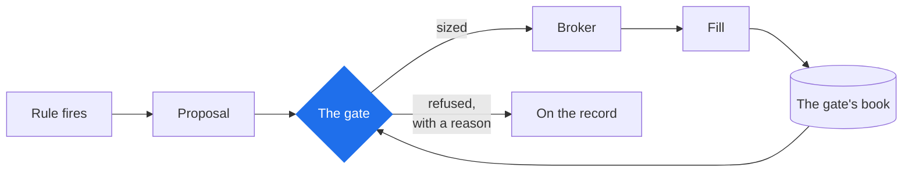

# The risk gate

**Your risk controls are the same in research, on paper and live.** Arvo does not
keep one set of rules for backtests and another for real trading, so a backtest
cannot assume a position your account would have refused. And if trading is
halted, restarting Arvo does not quietly remove the halt.

**How it works.** Every entry is a *proposal*. It goes to one gate, which either
sizes it or refuses it with a named reason; only what survives reaches the
broker. Fills come back to the same gate's book. Exits never ask — nothing may
stop you reducing risk.

**Why it is one gate and not two.** If the live side had its own risk engine,
every stored verdict would describe a system that does not exist. The same code
runs in both places, so a finding is a statement about what would actually have
happened.

Field-by-field detail is in [the risk model](../reference/risk-model.md).

## What the gate decides

The **Risk** tab shows the model in force, from `risk.json` in the project
(or Arvo's defaults when there is none), and what it refused. The
[reference](../reference/risk-model.md) lists every field: stop distance in
ATRs, risk per trade, the largest position, the drawdown halt, open
positions, the daily loss limit, correlation and sector caps, the
day-trading rule.

A refusal is a fact worth counting, not a log line: `Stale`, `TooSmall`,
`NoStop`, `NotWholeLot`, `DailyLossLimit`, `TooManyPositions`, `Correlated`,
`Halted`, and the rest — each named on the record.

## The warning band

At four fifths of any limit the gate says so, before it acts: the drawdown
against its halt, today's loss against the daily limit, positions against
the cap, day trades against the pattern-day-trader budget. A session near a
limit shows it on its row, in Operations and on the Risk tab, writes a
`warning` event to its record when a limit is entered or cleared, and
raises an alert on entering. The gate keeps accepting; this is the one
moment a person can act before it acts for them. A halted session is past
warning and shows none.

## What the gate never decides

**Exits.** Every check in the gate asks whether to *take* risk; none may
stop you shedding it. A halted account cannot propose, but it can always
close — an exit path that can be refused is not an exit path.

## Halts

The drawdown halt is permanent for the run and lifts for nobody. The kill
switch is a manual halt and lifts when a person releases it. A session that
starts against an account already holding positions adopts them and comes
up halted, naming what it found, until you look — a limit that a restart
lifts is not a limit.

## Instruments

The gate sizes against what the instrument's source says it is: its lot,
tick, hours. A standard option contract is a lot of a hundred units of the
deliverable, so a price times a quantity is money everywhere; a proposal
for two and a half contracts is refused as `NotWholeLot`, not rounded.
