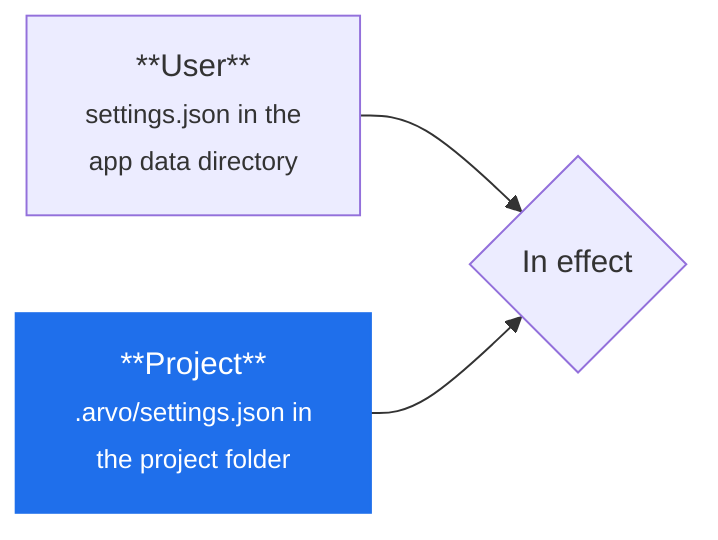

# Settings

**Settings are a file, not a dialog.** They use VS Code's key names, so if you
know VS Code you already know these.

## Two files, project on top



| | Where | Applies to |
|---|---|---|
| **User** | `settings.json` in the [app data directory](../engine/configure.md#the-app-data-directory) | everything you open |
| **Project** | `.arvo/settings.json` in the project folder | that project, overriding your own **key by key** — not file by file, so it only has to name what differs |

Settings → **Reveal config file** opens either.

Project settings are committable, which is the reason they exist: a project folder
can carry the interpreter and the agent it expects, and a second machine picks them
up.

## An example

```json title=".arvo/settings.json"
{
  "workbench.colorTheme": "Arvo Dark",
  "editor.fontSize": 13,
  "editor.minimap.enabled": false,
  "python.defaultInterpreterPath": ".venv/bin/python",
  "agent.command": "npx --yes @agentclientprotocol/claude-agent-acp"
}
```

Every key is listed in [the reference](../reference/settings.md). Unknown keys are
ignored rather than refused — settings are read as plain JSON, not against a fixed
schema — so a file written for a newer Arvo still loads, and you can keep notes in
it.

## Keybindings work the same way

`keybindings.json`, in the same two places, using VS Code's chord syntax — so
<kbd>Ctrl</kbd>+<kbd>K</kbd> <kbd>Ctrl</kbd>+<kbd>S</kbd> means what you expect.

## What is *not* in settings

Two things, deliberately:

| | Where instead | Why |
|---|---|---|
| **Credentials** | the operating system keychain | a token in a JSON file is a token in a backup, a screenshot and a commit |
| **The risk model** | `risk.json` in the project | it governs money, and it belongs with the research it applies to rather than with your font size |

Themes come from extensions rather than settings keys.
[Extensions →](../extend/extensions.md)
