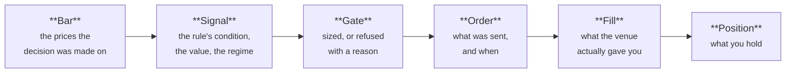

# Explain a position

**Answers "why do I own this?" from the record, not from your memory.**

Pick a moment, and Arvo prints the full chain behind everything held then — down
to the bar the decision was made on.

```sh
arvo-engine session explain twin_cross@alpaca-paper 2026-09-25T14:35:00Z
```

`<time>` is RFC 3339, or `YYYY-MM-DD HH:MM:SS` read as UTC.

!!! tip "This one needs nothing running"
    It reads the session's record on disk. The engine need not be running, and the
    session need not exist any more — a session you stopped last month still
    explains itself.

## What comes back

One chain per position held at that instant:



| Link | Tells you |
|---|---|
| **Bar** | The prices the rule saw. If it looks wrong, the data is the problem, not the rule |
| **Signal** | Which condition fired, the value it fired on, and the market regime at the time |
| **Gate** | The size it allowed and why — or, for a position you do not have, why it refused |
| **Order** | What was sent and when it was stamped, which is how a stale order is spotted |
| **Fill** | What the venue actually did. The gap from the decision price is slippage, measured |
| **Position** | Quantity and entry, as the session believes it |

Two cases it handles explicitly rather than leaving blank:

- **A flat session** says so, and names the last change to the book — so "nothing
  held" is distinguishable from "no record".
- **An adopted position** — one that existed before the session started — says it
  was adopted, because no signal of this session's caused it and pretending
  otherwise would be a fabricated chain.

## When you would use it

- A position you do not recognise appeared. Start here before anything else.
- A fill looks far from where the rule decided, and you want to know how far.
- A rule did not trade when you expected it to — the gate's refusal is on the
  record with its reason.
- You are reconstructing a day after the fact, in which case
  [the review](../features/review.md) covers the whole session and this covers one
  moment.

## Related

[The audit chain and the journal](../features/journal.md) — how the record is
built, and what else is on it.
