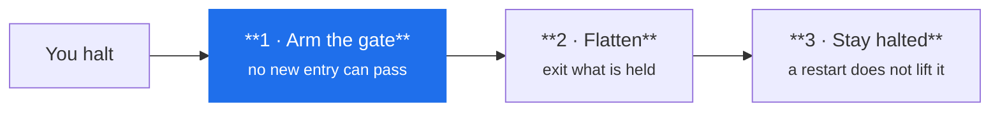

# Halt trading

**One action stops everything and keeps it stopped.** Use it when you want
trading to end now and you do not want to think about the details.

## Do it

=== "From the window"

    | Where | Stops |
    |---|---|
    | A session's **Halt** button, in Sessions or Operations | that session |
    | Tray → **Halt trading** | every running or frozen session, with the window closed |

=== "From a terminal"

    ```sh
    arvo-engine session halt --all "spread blew out"     # everything
    arvo-engine session halt twin_cross@alpaca-live      # one session
    ```

    The reason is optional and worth giving — it goes on the record and into the
    review, and in a week you will not remember.

## What it does, in order

The order matters and is deliberate:



The gate closes **before** anything is sold. If it flattened first, a rule firing
in that instant could open a new position straight into the exit.

## Then check it worked

!!! danger "A halt reports what it could not do — read the output"
    If the venue refuses an exit, the halt **names the instrument** rather than
    reporting success. Those positions are still yours, and nothing is watching
    them any more.

```sh
arvo-engine session list
```

A halted session stays up briefly to book its exits' fills, then sits halted.
Confirm at the broker that the account is flat before you walk away — Arvo tells
you what it asked for, and the broker is the authority on what happened.

## It stays halted

A restart does not lift it. A new session will not start under it. A person clears
it deliberately.

That is the point: a limit a restart lifts is not a limit. If halting were
something a crash could undo, it would not be a safety control.

## Stop versus halt

| | Stops the rule | Exits positions | Survives a restart |
|---|---|---|---|
| **Halt** | yes | yes | **yes** |
| **Stop** | yes | **no** | no |

`stop` ends a session and leaves the book alone — right when you are done for the
day with nothing held, wrong when something is open. If you are unsure which you
want, you want halt.

## The drawdown halt is a different thing

The risk gate halts a session on its own when drawdown reaches the model's limit.
That is not the kill switch and does not lift for anybody, including you — the
model has to change for trading to resume. [The risk gate →](../features/risk.md)

## Related

[When a session freezes](frozen-session.md) — a freeze is not a halt; it is Arvo
saying it is unsure what it holds and waiting for you.
