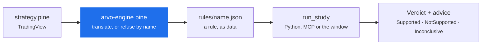

# From a Pine script to a verdict

One worked example, end to end. Every artifact below is real output from
`arvo-engine pine`, not an illustration.

The shape: a Pine script becomes a **rule file**, and the rule is what Arvo
studies. There is no "Pine runtime" — the script is translated once, into data
you can read.



## 1. The script

An RSI dip in an uptrend — the second-commonest shape on TradingView after a
moving-average cross.

```js title="rsi_dip.pine"
//@version=5
strategy("RSI dip in an uptrend", overlay=true, initial_capital=100000)

rsiLength = input.int(14, "RSI length")
trendLength = input.int(200, "Trend EMA")
oversold = input.int(30, "Oversold")
exitLevel = input.int(60, "Exit level")

trend = ta.ema(close, trendLength)
osc = ta.rsi(close, rsiLength)

plot(trend, "Trend", color=color.orange)
plot(osc, "RSI", color=color.blue)

if osc < oversold and close > trend
    strategy.entry("long", strategy.long)

if osc > exitLevel
    strategy.close("long")
```

## 2. Translate it

```sh
arvo-engine ~/arvo pine rsi_dip.pine --interval 1day
```

It says what it set aside before it says anything else:

```
set aside  strategy("RSI dip in an uptrend", overlay=true, initial_capital=100000)
           (the strategy's own account settings; Arvo's risk model sizes every trade)
set aside  plot(trend, "Trend", color=color.orange)   (drawing; it changes nothing the rule trades)
set aside  plot(osc, "RSI", color=color.blue)         (drawing; it changes nothing the rule trades)

rsi_dip_in_an_uptrend — enter when osc < oversold and close > trend; leave when osc > exitLevel
```

Three things worth noticing in that output:

- **`initial_capital` was dropped, and it says so.** Arvo's risk model sizes
  every trade, so a figure the script chose would be overridden silently
  otherwise.
- **The plots were read and set aside**, not ignored — so you can see the
  translator looked at them and decided they did not affect what trades.
- **It restates the rule in English.** If that sentence is not your strategy,
  stop here.

!!! warning "It refuses rather than approximates"
    Had the script used `request.security`, `strategy.short`, `ta.stoch` or `:=`,
    the import would have **failed and named each one**. A partially translated
    rule runs, produces a curve, and is not the strategy anybody wrote — which is
    worse than no import at all. [Import from Pine →](../features/pine.md)

## 3. The rule it produced

This is the actual JSON, unedited:

```json title="rules/rsi_dip_in_an_uptrend.json"
{
  "name": "rsi_dip_in_an_uptrend",
  "label": "RSI dip in an uptrend",
  "premise": "",
  "interval": { "step": 1, "unit": "day" },
  "params": {
    "exitLevel": 60.0,
    "oversold": 30.0,
    "rsiLength": 14.0,
    "trendLength": 200.0
  },
  "indicators": {
    "osc":   { "kind": "RSI", "input": "close", "period": "rsiLength" },
    "trend": { "kind": "EMA", "input": "close", "period": "trendLength" }
  },
  "entry": {
    "and": [
      { "<": [ { "var": "osc" }, { "var": "oversold" } ] },
      { ">": [ { "var": "close" }, { "var": "trend" } ] }
    ]
  },
  "exit": {
    ">": [ { "var": "osc" }, { "var": "exitLevel" } ]
  },
  "source": {
    "kind": "pine",
    "title": "RSI dip in an uptrend",
    "author": "",
    "hash": "e44ae47833bb5d1014295469d1b2f41985c4bceab28cee7f2dccd9cbb2229953"
  }
}
```

The parts that matter:

| | |
|---|---|
| `params` | Pine's `input.int` defaults became parameters — which is what makes a **ruleset** possible over them |
| `indicators` | named series; the conditions read them by name |
| `entry` / `exit` | [JSON Logic](https://jsonlogic.com), so a condition is data rather than code |
| `source.hash` | a fingerprint of the original script, so a finding traces back to the exact text — and an edited script is a different source |

`premise` is empty because Pine has nowhere to say one. Worth filling in by hand:
it is the sentence you will read in six months when the finding no longer speaks
for itself.

Add `--keep` to write it under `rules/`:

```sh
arvo-engine ~/arvo pine rsi_dip.pine --interval 1day --keep
```

## 4. Run it, from Python

A written rule is offered under its own name, so it runs like any rule Arvo
ships.

```python title="study.py"
import arvo

engine = arvo.connect()

found = engine.run_study(
    "SPY.YF",
    "rsi_dip_in_an_uptrend",
    author="script:pine-import",
)

# These three first, before any number.
print(found.verdict)
print(found.read_this_first)
for item in found.advice:
    print(f"  [{item.severity}] {item.finding} -> {item.action}")
```

**`author` is required**, and it is the mechanism that stops importing twenty
scripts and keeping whichever passed: every run is deflated against everything
that author has run.

## 5. What you are likely to get

Be ready for `Inconclusive`. This rule enters only when RSI is below 30 *and*
price is above a 200-day average, which on one instrument over ten years is a
handful of trades — not enough for a mean return to mean anything.

That is not the import failing. It is the honest answer to a question asked of
too little evidence, and the two usual ways forward are:

- **Breadth.** Run it across a [universe](../features/universes.md) as a panel, so
  trades pool across instruments instead of the bar being lowered.
- **A ruleset.** Vary `rsiLength` and `oversold` — and accept that searching a
  grid raises the bar the winner must clear.
  [Write a ruleset →](write-a-ruleset.md)

```python
panel = engine.run_panel("etf30", strategy="rsi_dip_in_an_uptrend")
print(panel.verdict, panel.read_this_first)
```

!!! note "The point of the exercise"
    TradingView will tell you this strategy's win rate. Arvo will tell you
    whether the win rate means anything — and often the answer is that nobody
    can know from the evidence available. That difference is the whole product.
    [Why Arvo is different →](../concepts/index.md)

## What Arvo can read today

**Translated:** `ta.sma`, `ta.ema`, `ta.atr`, `ta.rsi`, `ta.highest`,
`ta.lowest`; any `input.*` (its default becomes a parameter);
`strategy.entry`, `strategy.close`, `strategy.exit`; comparisons combined with
`and`, `or` and `not`.

**Refused by name, with the reason:**

| Construct | Why |
|---|---|
| `request.security`, `request.*` | another symbol or timeframe; a rule runs on one instrument at one interval |
| `strategy.short` | every rule here is long only |
| `strategy.order`, `strategy.cancel` | only entry, close and exit are read; resting orders are not modelled |
| `pyramiding` | one position at a time |
| `ta.macd` | returns three series from one call — declare MACD in a rule file, once per series you read |
| `ta.vwap`, `ta.stoch`, `ta.bb` | not among the seven indicators |
| `[1]` and other history references | a condition reads this bar's values, not an earlier bar's |
| `:=`, `var`, `varip` | state that persists across bars; a rule is a function of the bars it has seen |
| `for`, `while`, `switch` | no control flow in a condition |
| `array.*`, `matrix.*` | no collections |
| `alert` | Arvo's own alerts are the session's |

Two of those are worth knowing before you go looking for a script to import.
**`[1]`** — Pine's "value one bar ago" — is extremely common and is not
supported, so `close > close[1]` will not translate. And **`:=`** rules out any
strategy that accumulates its own state.

For anything on neither list, the import says so rather than guessing.
