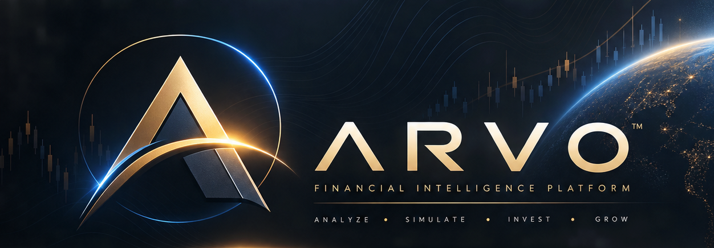
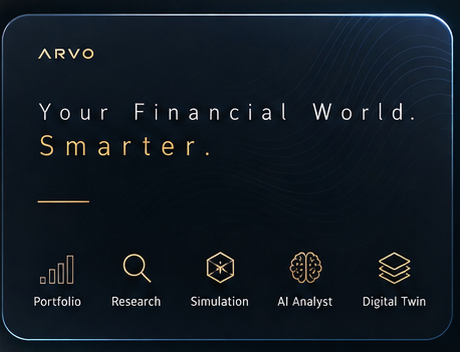

---
hide:
  - navigation
---

<div class="arvo-hero" markdown>

{ .arvo-hero-image }

<p class="tagline">Research, code and trading in one window, on an engine that keeps running when the window closes.</p>

</div>

Arvo is an AI-native research platform for systematic trading, closer to
"VS Code for quantitative finance" than to another backtesting engine. Its
premise is that **most backtest results are noise, and the job is to avoid
believing them**. Everything else follows from one rule:

> Anything that makes a wrong answer look right outranks anything that adds capability.

## What it does

<div class="grid cards" markdown>

- **Research that says when it does not know**

    A study runs a rule over a search of parameters, selects out of sample,
    deflates the result against how many things were tried, and answers with
    a verdict — `Supported`, `NotSupported` or `Inconclusive` — and advice you
    read before any number. [Research →](features/research.md)

- **One risk policy, backtest and live**

    The gate that sized every backtested trade sizes the live ones. A limit
    a restart lifts is not a limit; a halt stays in force until a person
    looks. [The risk gate →](features/risk.md)

- **Sessions you can watch, freeze and stop**

    A finding's rule runs against a paper or a real venue, streams its bars,
    audits its book against the venue every poll, freezes on a disagreement
    and waits for you. One kill switch, everywhere. [Sessions →](features/sessions.md)

- **Automated trading, explained**

    The end goal: a rule that survived research trades on its own, and
    every order it places can be walked back to a bar and a rule. The
    agent's part is to write and test the rules that trade, and to operate
    them; it does not place trades of its own. [Where this is going →](about/horizon.md)

- **An agent beside the code**

    The Agent panel runs Claude Code (or any Agent Client Protocol agent)
    with Arvo's research tools attached: it writes rulesets, runs studies
    and reads findings. [The Agent panel →](features/agent.md)

- **Every position explained**

    Bar → signal → gate → order → fill → position, one chain in the session
    record, with the rule, its value and the regime on every trade.
    [The audit chain →](features/journal.md)

- **Open at the edges**

    Extensions contribute themes and strategies as documents; providers are
    processes speaking a published protocol; the engine's API ships as Rust
    crates and a Python package. [Extending →](extend/extensions.md)

</div>

<figure class="arvo-card" markdown>
{ width="460" }
</figure>

## Where to start

1. [Install](getting-started/install.md) the window and the engine.
2. [Connect an account](getting-started/accounts.md) — Alpaca for bars and paper trading, Robinhood or Yahoo for bars.
3. [Run a study](how-to/run-a-study.md) and read its verdict.
4. [Start a paper session](how-to/paper-session.md) on a finding.

## The shape of it

```
Hypothesis → Experiment → Simulation → Evaluation → Evidence → Research memory → Agent
```

The **engine** (`arvo-engine`) runs studies, keeps the data library, holds
credentials, hosts sessions and serves a local API. The **window**
(`arvo-desktop`) is one client of that API; the **Python package**, the
**MCP server** and the **command line** are others. The engine keeps running
when the window closes, so a schedule runs and a session trades with nothing
open. [Architecture →](about/architecture.md)
