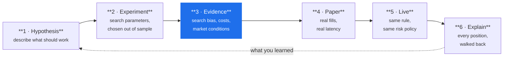
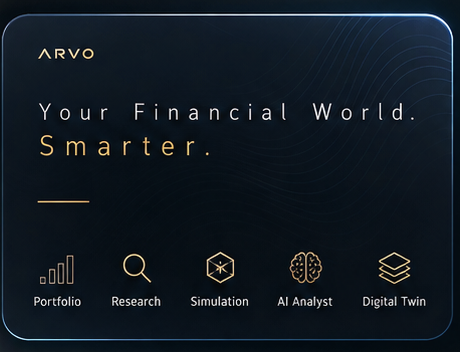

---
hide:
  - navigation
title: Arvo
description: An evidence-driven platform for systematic trading. Research an idea, test whether it holds up, paper trade it, run it live — and keep the evidence that explains every decision.
---

{ .arvo-hero-image }

Research. Test. Trade. Know why.

Arvo is a platform for systematic trading that treats **evidence as part of the
product**. Research an idea, test whether it holds up, paper trade it against a
real broker, run it live — and keep the record that explains how every decision
was made.

> Most platforms help you find a strategy that worked. Arvo is built on the
> assumption that most things that worked did not work — you just looked at
> enough of them.

## From idea to execution, in one place

```mermaid
flowchart LR
    H["**1 · Hypothesis**<br/><small>describe what should work</small>"]
    E["**2 · Experiment**<br/><small>search parameters,<br/>chosen out of sample</small>"]
    V["**3 · Evidence**<br/><small>search bias, costs,<br/>market conditions</small>"]
    P["**4 · Paper**<br/><small>real fills,<br/>real latency</small>"]
    L["**5 · Live**<br/><small>same rule,<br/>same risk policy</small>"]
    X["**6 · Explain**<br/><small>every position,<br/>walked back</small>"]

    H --> E --> V --> P --> L --> X
    X -.->|"what you learned"| H

    style V fill:#1f6feb,stroke:#1f6feb,color:#fff
```

**1 · Hypothesis.** Say what you think should work, as a rule with entries and
exits.

**2 · Experiment.** Test it over a range of parameters. Arvo chooses on one slice
of history and judges on a slice it never saw.

**3 · Evidence.** The result is weighed against how many things you tried, re-run
at higher costs, and read against the market conditions that produced it. You get
a verdict and advice, not just a number.

**4 · Paper.** Run it on a broker's paper endpoint and compare the price the rule
decided at with the price it actually got.

**5 · Live.** The same rule, under the same risk policy that sized every
backtested trade. Not a reimplementation — the same code.

**6 · Explain.** Any position walks back to the fill, the order, the risk
decision, the signal, the rule and the bar.

[What you can do with Arvo →](start/what-you-can-do.md){ .md-button .md-button--primary }
[Why it's different →](concepts/index.md){ .md-button }

## What makes Arvo different

- **It can tell you it doesn't know**

    Three verdicts, not two: `Supported`, `NotSupported`, and `Inconclusive`.
    A rule with eleven trades over twenty years has not been shown to work
    *or* to fail — and saying so is more useful than a ratio computed from
    eleven trades. [Research →](features/research.md)

- **It counts how much you searched**

    Try a hundred configurations and the best one looks good whether or not
    the rule has any edge. Arvo works out what the best of that many would
    score by luck, and makes the winner beat it.
    [Why Arvo is different →](concepts/index.md)

- **One risk policy, research and live**

    The code that sized every backtested trade sizes the real ones. A backtest
    cannot assume a position your live account would have refused, and a halt
    stays in force across a restart. [The risk gate →](features/risk.md)

- **Fills are measured, not assumed**

    A backtest assumes a fill. Paper trading on a real broker gives you an
    actual one, at an actual spread — so the gap between them is a measurement.
    [Sessions →](features/sessions.md)

- **Every position can be walked back**

    Bar → signal → risk decision → order → fill → position, as one chain, with
    the rule and the market conditions on every trade.
    [The audit chain →](features/journal.md)

- **An agent that cannot reach your money**

    Attach Claude Code and it writes rules, runs studies and reads findings.
    It holds no credential and has no tool that places an order — enforced by
    the build, not by a prompt. [The Agent panel →](features/agent.md)

## Who it's for

| | |
|---|---|
| **Traders with a systematic idea** | You have a strategy and want to know whether it survives honest testing before it sees money |
| **Developers** | Rules are data, the API ships as Rust crates and a Python package, and the engine runs headless with no window at all |
| **Quantitative researchers** | Out-of-sample selection, deflation against search size, walk-forward, cost sensitivity and regime analysis, with replayable findings |
| **People arriving from TradingView** | Bring a Pine script in, and find out what it does under evaluation it has never had |

## What it costs you

Stated plainly, because it's the other side of the design:

- **Fewer results will look good.** That is the product working.
- **A genuine but weak edge may come back `Inconclusive`.** The bar is
  deliberately conservative.
- **It is slower to a conclusion** than a tool that reports the best of a sweep —
  because it refuses to report the best of a sweep.

## Start

Two routes, depending on why you're here.

- **I want to test and trade my ideas**

    Install, connect an account, write a ruleset, run a study, read the verdict,
    paper trade what passed.
    [The trading path →](start/paths.md#i-want-to-test-and-trade-my-ideas)

- **I want to build on it**

    Run the engine headless, drive it from the command line, Python or an agent,
    then extend it.
    [The developer path →](start/paths.md#i-want-to-build-on-it)

<figure class="arvo-card" markdown>
{ width="460" }
</figure>

## Under the hood

The **engine** runs studies, keeps the data library, holds credentials, hosts
sessions and serves a local API. The **window** is one client of it; so are the
Python package, an MCP agent, and the command line. The engine keeps running when
the window closes, so a schedule runs and a session trades with nothing open.

[Architecture →](about/architecture.md) ·
[Where this is going →](about/horizon.md) ·
[Run it headless →](engine/index.md)
