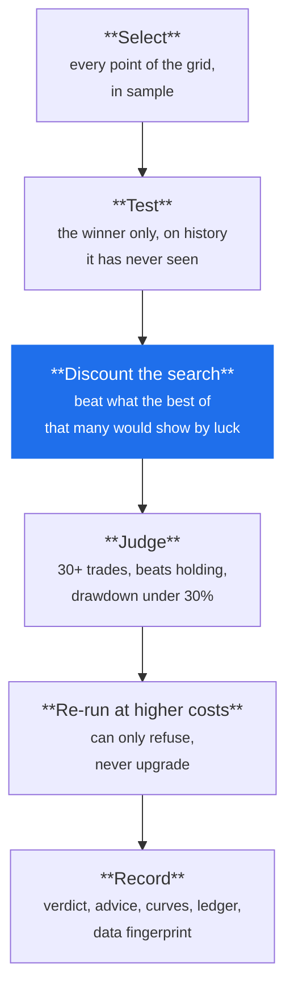

# Why a backtest lies

*Level 7. Assumes [strategy families](families/index.md). This is the level that
changes how you read every other one.*

## The idea

A backtest does not tell you whether a strategy works. It tells you that a
particular set of rules, applied to a particular slice of history, produced a
particular curve.

Turning that into "this works" requires the curve to be evidence of something
repeatable. Usually it is not — and the reasons are specific, well understood, and
almost all of them feel like diligence while you are committing them.

This is the level that is genuinely hard, and it is the reason Arvo exists in the
shape it does.

## The six ways it happens

### 1. You searched, and the best of a search looks good by luck

Test one configuration and a good result is mild evidence. Test a hundred and take
the best, and a good result is *what luck produces*. Nothing went wrong; you
sampled the top of a distribution, and the top of any distribution looks
impressive.

Flip a coin ten times and you will probably see five or six heads. Do the whole
ten-flip run a hundred times over and the best run will show eight or nine. That
run is not a skilled coin.

This is the most common cause of a strategy that works in testing and not in an
account, and it is why **the size of your search is part of your result**.

### 2. You chose and judged on the same data

If you pick the configuration that did best on 2019 to 2024 and then report how it
did on 2019 to 2024, you have reported the selection, not a test. The number is
guaranteed to look good and means nothing.

The fix is to split: choose on the first part **in sample**, judge only on the
held-out part **out of sample**, which the chosen configuration has never seen.

### 3. You used information that did not exist yet

**Look-ahead bias**, and it is usually accidental:

- Filtering on a regime label computed over the whole window — see [level
  3](market-types.md).
- Using a closing price to make a decision that would have been taken during the
  day.
- Assuming, in a bar whose high hit your target and whose low hit your stop, that
  the good one came first. A bar cannot tell you the order, as [level
  2](charts.md) covered.
- Using an index membership list from today to trade 2015.

Each of these produces a curve that is not merely optimistic but impossible.

### 4. You searched things you did not count as searching

The instrument. The window. The timeframe. Which indicator. Whether to include
2020. Every one of those is a trial, and none of them appear in a parameter grid.

Someone who runs a grid of nine on twelve instruments across three timeframes has
performed 324 trials and will honestly report "I tested nine configurations". This
is the hardest one to defend against, because it happens across days and feels like
research rather than searching.

### 5. You assumed trading was cheaper than it is

Spread, commission, slippage, fees — and the fact that all of them are worst
exactly when your rule most wants to trade. A strategy whose edge is thinner than
its costs is extremely common, and it looks completely fine at optimistic costs.

### 6. Your data was the survivors

Testing on names that still exist, or on today's index members. The failures were
removed, so the dataset has the answer baked in. Invisible, because the evidence was
deleted. This is the one **no statistical method can detect** — it has to be
prevented when the data is chosen.

## What Arvo does about it

Every study runs through six steps, in this order, and you cannot turn them off:

Mapped against the six problems above:

| Problem | Defence | Complete? |
|---|---|---|
| 1 — the search | **Deflation**: the winner is judged against the expected best of that many random trials | yes, for the grid |
| 2 — same data | The split is compulsory, and only out-of-sample numbers are reported as the result | yes |
| 3 — look-ahead | A rule may filter on a signal series only when it is marked **causal**, enforced in the data layer | largely |
| 4 — uncounted searches | `author` is required on every run, and a run is deflated against **everything that author has run** | partly — see below |
| 5 — costs | Anything that would be Supported is re-run at **conservative** costs and refused if it fails. This step can only refuse, never upgrade | yes |
| 6 — survivorship | Nothing. A universe requires a **written reason** for its membership; a file without one is refused | **no** |

Three of those deserve elaboration.

**Deflation, concretely.** Given how many configurations were tried, what would the
*best of that many* score if the rule had no edge at all? That number is the bar.
It is reported on every finding, alongside whether it was cleared. A result that
beats a single-guess bar but not the best-of-nine bar is not evidence — and it is
why every lesson in [level 6](families/index.md) keeps its grid small.

**The author trick, closed.** A script that runs configurations until one passes is
problem 4 in its purest form. Arvo requires an `author` on every run, saves the
finding under it, and deflates against everything that author has run. Trying until
something passes does not make it pass, and the Runs tab shows each author's
findings with the size of the search they were held to.

**Survivorship, admitted.** Arvo cannot see it, and says so rather than implying its
gates are complete:

!!! warning "A defence documented without its limits misleads"
    Deflation corrects for *searching*. It cannot see survivorship bias — a
    universe of today's index members contains only companies that survived, and no
    search was performed to select them, so every gate passes such a result
    honestly. Knowing what a defence does **not** cover is part of using it. The
    written reason a [universe](../features/universes.md) demands is the only
    defence available, and it is yours.

## What people get wrong

**Treating a passed backtest as a conclusion.** It is the beginning of the
evidence, not the end. The next step is [paper trading](paper-to-real.md), which
measures things no backtest can.

**Re-running after a failure until it passes.** Every re-run is a trial. Adjust and
retest ten times and you have searched ten times, so the honest bar is now much
higher. Arvo counts this per author for exactly this reason.

**Believing more data is always the fix.** More history helps the trade count and
hurts in another way: markets from twenty years ago had different costs, different
participants and different microstructure. A rule that needs 1995 to look good is
telling you something.

**Ignoring `Inconclusive`.** It is not a soft fail. It means the test could not
answer the question, and the right response is a better test, not a different rule.
That is [level 8](reading-a-verdict.md).

## Try it

The honest exercise for this level: **try to make a rule pass, and watch Arvo count
it.**

1. Pick an instrument and run `sma_cross` — the control, a rule nobody disputes.
2. Widen a ruleset's grid deliberately: four values on each of two axes is sixteen
   configurations.
3. Run it, and read the deflation line. The bar moved up because you searched more.
4. Now run several variations under the same `author`, and watch the Runs tab show
   the search size you are being held to.

You will have demonstrated problems 1 and 4 to yourself on your own data, which is
worth more than reading about them.

## Watch

<!-- TODO: curate. Channel name and year beside each link so a dead link is
     visibly dead; re-check when this page is next edited. -->

- *(to be chosen)* — overfitting shown visually, with a curve fitted to noise.
- *(to be chosen)* — the multiple comparisons problem, outside of finance.

## Next

[Reading a verdict](reading-a-verdict.md) — what Arvo tells you, and in what order
to read it.
