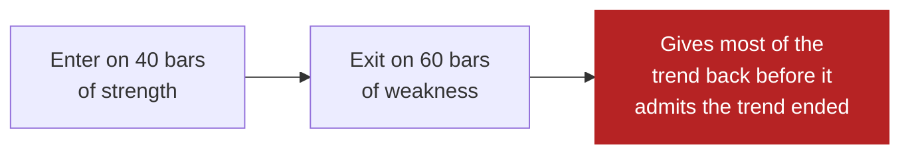

# Entries and exits

*Level 4. Assumes [market types](market-types.md).*

## The idea

A rule is two decisions, not one. Beginners spend nearly all their effort on the
first and nearly none on the second, and it is the second that decides the
result.

The entry chooses *when you are exposed*. The exit chooses *how much of the move
you keep, and how much a mistake costs*. You can pair a mediocre entry with a
good exit and make money. The reverse almost never works.

Four ways out, and a rule usually has more than one:

| Exit | Fires when | Gives you |
|---|---|---|
| **Signal** | the condition that got you in reverses | a full ride, with the end given back |
| **Stop** | price goes against you by a set amount | a bounded loss, and being taken out of moves that recover |
| **Target** | price reaches a set profit | a high win rate, and a cap on your best trades |
| **Time** | a period elapses | an answer on positions that go nowhere |

## Why it matters

The arithmetic. What a strategy earns per trade is its **expectancy**:

```
expectancy = (win rate × average win) − (loss rate × average loss)
```

Two rules, both real shapes you will meet:

| | Win rate | Average win | Average loss | Expectancy |
|---|---|---|---|---|
| **A** — target exit | 70% | 1.0 | 2.0 | (0.7 × 1.0) − (0.3 × 2.0) = **+0.10** |
| **B** — trend exit | 35% | 4.0 | 1.0 | (0.35 × 4.0) − (0.65 × 1.0) = **+0.75** |

Rule B is wrong twice as often as it is right and earns seven times as much per
trade. This is not a trick of the numbers — it is the normal shape of trend
following, and it is why **win rate on its own tells you nothing**. Anyone
advertising a 90% win rate is telling you about one column of a four-column
table.

The exit is what sets those two columns. A target exit raises the win rate and
truncates the average win. A trailing exit lowers the win rate and lets the
average win run. You are choosing a distribution, not a hit rate.

## What it looks like

An asymmetry worth internalising: **your stop is a decision you make once, and
your exit is a decision you make repeatedly.** The stop is the only part of a
trade whose worst case you control in advance. Everything else is the market's
choice.

Which is why the shape below is the one Arvo refuses outright — quick to buy,
slow to sell:



It feels patient. It is not patient — it is asymmetric in the wrong direction,
and it is the most common beginner shape because holding a loser feels like
conviction.

## What people get wrong

**Trading without a stop, then inventing one.** A position with no predetermined
exit has an unbounded loss and no position size can be computed for it. "I'll
watch it" is not a stop.

**Widening a stop that is about to be hit.** This converts a known small loss
into an unknown large one, and it is the single most destructive habit in
trading. The stop was correct when you were calm.

**Optimising the entry for months.** The entry is the parameter people tune
because it is the visible part. It is also where tuning does the most damage: see
[level 7](backtest-lies.md).

**Treating a target as free.** Capping your winners while your losers are
uncapped inverts the table above. Rule A survives only because its win rate is
genuinely high; most beginner targets pair a truncated win with an unbounded loss.

## See it in Arvo

- **An exit never asks the risk gate.** Every check in the gate asks whether to
  *take* risk; none may stop you shedding it. A halted account cannot open, but it
  can always close — an exit path that can be refused is not an exit path.
- A stop is set as `stop_atr_multiple` in `risk.json`: stop distance as a multiple
  of average true range, so "a stop" means the same thing on a $20 stock and a
  $600 one. **Not set runs with no stop**, and the Risk tab says so rather than
  showing a default as if you chose it.
- `risk_per_trade` **needs a stop** — without one there is no loss to size
  against, and a proposal with no stop is refused as `NoStop`. The arithmetic is
  in [level 5](risk-and-sizing.md).
- `momentum_breakout` refuses `exit_period` above `entry_period`, with the reason
  quoted above. The engine will not run the shape in the diagram.
- Every trade's **exit reason** is on the record, so "why did it sell?" is
  answerable per round trip, not inferred from a curve.

## Watch

<!-- TODO: curate. Channel name and year beside each link. -->

- *(to be chosen)* — expectancy worked through with real numbers.
- *(to be chosen)* — why a high win rate can lose money.

## Next

[Risk and sizing](risk-and-sizing.md) — the part that decides whether you
survive, which comes before the part that decides whether you profit.
