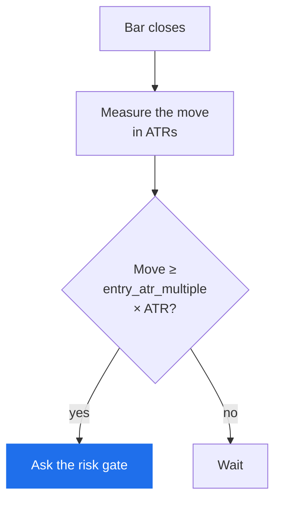

# Volatility breakout

*Level 6 — strategy families.*

## The claim

> A move far larger than this instrument's normal daily range is the start of
> something, not the end of it.

The close cousin of [trend following](trend-following.md), with one important
difference: a trend follower waits for a price *level* to be exceeded, a
volatility breakout waits for a *thrust* — a move large relative to how much this
instrument normally moves.

That relativity is the whole idea. A $3 move is enormous in a utility and noise in
a high-priced tech name. Measuring the move in **ATR** — average true range, the
typical distance between a bar's high and low, averaged over a lookback — makes
"unusually large" mean the same thing on any instrument at any price.

## Why anyone believes it

**Volatility clusters.** This is among the most robust facts in financial data:
large moves are followed by large moves, and quiet periods are followed by quiet
periods. Whatever caused today's thrust has not finished happening.

**A thrust is evidence of forced activity.** Ordinary two-sided trading produces
ordinary ranges. A day three times the normal range usually means somebody had to
transact regardless of price — a fund liquidating, an index rebalancing, a
position being covered. Those flows take time to complete.

**It fires before a level is exceeded.** A channel rule needs price to reach a
forty-day high. A thrust rule can fire on the day the move happens, from
somewhere in the middle of a range. Earlier entry, and more false ones.

!!! note "Say the cost"
    Volatility clustering is reliable. **Volatility clustering with a direction is
    not.** The evidence that large moves follow large moves is much stronger than
    the evidence that they continue the same way, and this family lives entirely
    on the weaker half of that claim.

## What it looks like

A single bar that dwarfs its neighbours, often with a gap. On a chart it is the
most visually obvious of all the families, which is part of why it attracts
beginners and part of why it is crowded.

`volatility_breakout` takes two numbers:

| Parameter | Means |
|---|---|
| `atr_period` | how many bars the average true range is measured over |
| `entry_atr_multiple` | how many ATRs the move must be to count as a thrust |



The rule cannot act until it has `atr_period` bars — there is no average true
range before then, and Arvo will not manufacture one.

## When it fails

**The gap is the loss.** A thrust often happens overnight, so the move you were
waiting for is already in the price when you can act. You are buying after the
information, at a worse price, with your stop now further away.

**Spreads widen exactly when it fires.** Every cost you pay is at its worst on a
high-volatility day. This family is the most cost-sensitive of the six, and
[conservative costs](../../glossary.md) eliminate more breakout findings than any
other kind.

**Reversal days look identical to continuation days.** A capitulation low and a
breakdown are the same bar. The rule cannot distinguish them, and the difference
in outcome is total.

**Too low a multiple turns it into noise.** At 1.0 ATR you are firing on ordinary
bars several times a week. At 3.0 you may get four signals a year, which is not a
sample. The parameter trades signal quality against having any evidence at all,
and both ends fail.

## Test it

`rulesets/thrust.json`:

```json
{
  "name": "thrust",
  "label": "Volatility breakout",
  "premise": "A close moving more than two ATRs continues far enough to pay for the reversals.",
  "interval": { "step": 1, "unit": "day" },
  "kind": {
    "kind": "grid",
    "rule": "volatility_breakout",
    "fixed": { "trade_size": 10.0, "atr_period": 14.0 },
    "axes": { "entry_atr_multiple": [1.5, 2.0, 2.5] }
  }
}
```

Three configurations, with `atr_period` pinned at 14 rather than searched — pin
what you are not asking about, because every axis you add raises the deflation bar
the winner must clear.

Research view → pick `thrust` → pick an instrument → **Run**. Then:

1. **Check the trade count first.** At 2.0 ATR on two years of daily bars you may
   get a dozen trades. Under thirty, the verdict will be `Inconclusive` and the
   advice will tell you to widen the window rather than loosen the entry.
2. **Read the cost tiers.** If the finding is Supported at stated costs and fails
   at conservative, the advice says *Supported only under the stated costs* — the
   edge belonged to the cost assumption, not the rule. For this family, expect it.
3. **Check the regime split.** Breakouts that only worked in one direction are
   common, and a rule that only works in trending-up markets is a bet on
   conditions, honestly labelled.

## Watch

<!-- TODO: curate. Channel name and year beside each link. -->

- *(to be chosen)* — ATR explained and computed by hand.
- *(to be chosen)* — volatility clustering, shown on a real series.

## Next

[Mean reversion](mean-reversion.md) — the opposite claim.
