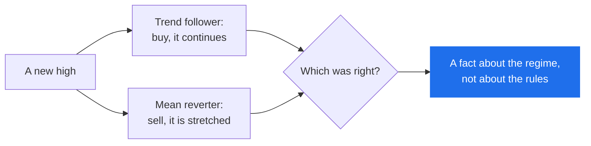

# Strategy families

*Level 6. Assumes [risk and sizing](../risk-and-sizing.md).*

There are not hundreds of strategies. There are a handful of **claims about how
prices behave**, and thousands of implementations of them. Learn the claims and
the implementations stop being mysterious.

Six families have a lesson here, because six are what Arvo ships a rule for. If a
family is not listed, Arvo cannot test it, and by [the rule of this
section](../index.md) it does not get a page.

## The six

| Family | The claim, in one line | Arvo's rule | Needs |
|---|---|---|---|
| [Trend following](trend-following.md) | what has gone up keeps going up long enough to pay for the false starts | `momentum_breakout` | a trend |
| [Volatility breakout](breakout.md) | an unusually large move is the start of something, not the end | `volatility_breakout` | expansion |
| [Mean reversion](mean-reversion.md) | price stretched away from a fair value comes back to it | `vwap_reversion` | a range |
| [Relative strength](relative-strength.md) | the strongest few keep outrunning the rest | `cross_sectional_momentum` | dispersion, and many names |
| [Opening range](opening-range.md) | where a session goes in its first minutes sets where it goes after | `opening_range` | a session |
| [Selling options](selling-options.md) | you get paid to take on risk other people want to shed | `put_spread` | recorded chains |

`sma_cross` is in Arvo as the **control** — a rule nobody disputes, not a good
idea. Use it the way you would use a placebo: if your clever rule cannot beat it,
you have learned something.

## The two that matter most are opposites

Trend following and mean reversion are each other's failure mode. Given the same
instrument and the same year, they disagree on every trade:

Both claims are true, in different conditions, and neither tells you which
condition you are in — see [market types](../market-types.md). This is why "which
strategy is best?" has no answer, and why the useful question is "what does this
one need, and can I tell when it has it?"

## How to use these six lessons

Read them in any order; they do not depend on each other. Each one ends in a
ruleset you can run, and each one tells you the verdict to expect — which on a
single instrument over a couple of years is usually `Inconclusive`, for reasons
[level 8](../reading-a-verdict.md) covers.

!!! tip "Run the control first"
    Before testing any family on an instrument, run `sma_cross` on it. You learn
    what that instrument's history does to a rule that has no edge, and every
    result afterwards has something honest to sit against.

## What is not here

Named so you know they were considered rather than forgotten:

- **Chart patterns read by eye** — head and shoulders, flags, wedges. Not
  testable without turning "I see a flag" into a condition, at which point it is a
  rule and belongs in [rules as data](../../features/rulesets.md#rules-as-data).
- **Fundamental and sentiment strategies** — Arvo keeps bars, dividends, quotes
  and chains. A rule needing earnings transcripts or positioning data has no data
  layer here.
- **Pairs and statistical arbitrage** — needs two instruments traded against each
  other as one position, which nothing in Arvo currently books.
- **Scalping** — the edge lives below the bar, in the order book, and Arvo studies
  bars.

## Next

Start with [trend following](trend-following.md), the best-documented edge in
public markets and the one whose failure mode teaches the most.
