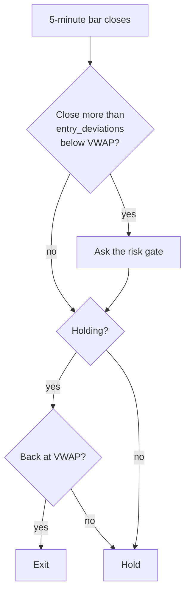

# Mean reversion

*Level 6 — strategy families.*

## The claim

> Price pushed unusually far from a fair value comes back to it.

The direct opposite of [trend following](trend-following.md), and also true — in
different conditions. Where a trend follower buys strength, a mean reverter buys
weakness, on the argument that the weakness was an overshoot rather than
information.

Everything depends on what "fair value" means, and the honest answer is that it is
always a proxy. Arvo's intraday rule uses **VWAP** — the volume-weighted average
price since the session opened, the average price at which the day's business
actually happened. It is a reasonable proxy for "what this thing traded at today"
and it is not a valuation.

## Why anyone believes it

**Someone needed to sell, and need is not information.** A fund meeting
redemptions sells at whatever price clears. That pushes price away from where
two-sided trading would have left it, and when the seller is done, it drifts back.
You are being paid for supplying liquidity at an inconvenient moment.

**Market makers have to reverse.** The people quoting both sides of the market end
up holding whatever the flow hands them and must unwind it. Their unwinding is
mean-reverting pressure, mechanically.

**It has a high win rate, which is psychologically the reverse of trend
following.** Most trades are small winners. That makes it easy to trade and
dangerous to size — see below.

!!! note "Say the cost"
    Mean reversion wins often and loses badly. It is the family most likely to
    show a beautiful equity curve for two years and then give all of it back in a
    week, because the losing case is not a small loss — it is the one time the move
    *was* information. The curve's smoothness is not evidence of safety; it is what
    this payoff shape looks like right up until it isn't.

## What it looks like

A price stretched well below the day's volume-weighted average, then closing back
toward it. `vwap_reversion` takes one number:

| Parameter | Means |
|---|---|
| `entry_deviations` | how far below VWAP a close must be to count as stretched |



The exit is the mean itself, which is the defining feature of the family: **the
target is known when you enter.** A trend follower has no idea where its exit will
be; a mean reverter knows exactly, and that certainty is what caps the upside.

This is a 5-minute rule — VWAP resets each session, so it is meaningless on daily
bars, and Arvo refuses to run it on them. It also needs at least five bars of a
session before a volume-weighted deviation means anything.

## When it fails

**It sells the start of every trend.** In a market that keeps making new lows, "far
below VWAP" is true every bar, all the way down. Each trade is entered a little
lower and each one loses. This is the mirror of a trend follower in a range, and it
is the same mistake with the sign flipped.

**The payoff is bounded up and unbounded down.** Your profit is capped at the
distance back to VWAP. Your loss is capped at nothing in particular. A win rate of
75% with that asymmetry can still have negative expectancy — go back to [the
expectancy table](../entries-and-exits.md) and put the numbers in.

**A stop is not optional here, and it fights the strategy.** The premise is that
price has gone too far, so any stop is a bet against your own thesis at the point
it is most stretched. Trading without one is worse. There is no comfortable answer,
and anyone who tells you otherwise is selling something.

**Intraday means costs dominate.** Many trades, each with a small target, all
paying the spread twice. This is the family where the [cost
tiers](../../reference/verdicts.md#cost-tiers) do the most work.

## Test it

Intraday rules need 5-minute bars in your library, so fetch them before you run.

`rulesets/stretch.json`:

```json
{
  "name": "stretch",
  "label": "VWAP reversion",
  "premise": "A close well below the session's VWAP returns to it often enough to pay for the days it does not.",
  "interval": { "step": 5, "unit": "minute" },
  "kind": {
    "kind": "grid",
    "rule": "vwap_reversion",
    "fixed": { "trade_size": 10.0 },
    "axes": { "entry_deviations": [1.0, 1.5, 2.0] }
  }
}
```

What to look at, in this order:

1. **The trade count will not be your problem here** — an intraday rule generates
   plenty. That makes this the best family to learn on, because you will get real
   verdicts rather than `Inconclusive`.
2. **Compare stated against conservative costs.** This is the test that matters
   for this family. A rule earning a few basis points per trade and paying the
   spread twice is usually a cost story.
3. **Look at the worst trade, not the average.** On the Trades tab, find the
   largest loss and ask whether your `risk_per_trade` would have survived several
   of them in a row. The average trade is not what ends accounts.
4. **Check the regime split.** Expect this rule to earn in ranging periods and
   bleed in trending-down ones. If it does, you have confirmed the theory and
   learned what you own.

## Watch

<!-- TODO: curate. Channel name and year beside each link. -->

- *(to be chosen)* — VWAP, how it is computed and why institutions watch it.
- *(to be chosen)* — a high-win-rate strategy failing, with the trade sequence.

## Next

[Relative strength](relative-strength.md) — ranking names against each other
instead of judging each on its own.
