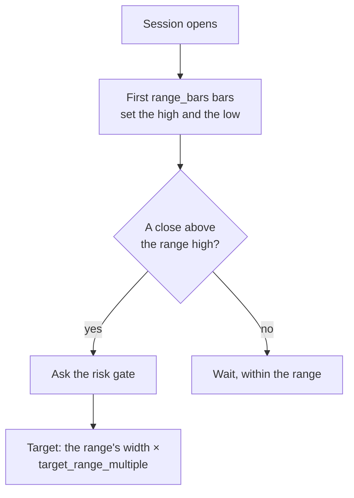

# Opening range

*Level 6 — strategy families.*

## The claim

> Where a session trades in its first minutes sets a range, and leaving that range
> says where the rest of the day goes.

This is the most popular intraday strategy in existence, and the only one in this
section that is defined against a **trading session** rather than against price
history in general. It has a beginning and an end each day, which makes it
concrete in a way the daily families are not.

The range is built from the session's first few bars — its high and its low. A
close above the high enters, with a target measured in multiples of the range's own
width.

## Why anyone believes it

**The open concentrates information.** Everything that happened while the market
was closed — earnings, overnight news, other time zones — has to be priced in at
once, by everyone, at the same moment. That is a genuine event, not a statistical
artefact.

**The open has the day's deepest liquidity, and its widest disagreement.** Orders
accumulated overnight arrive together. The first minutes are where the day's
argument is settled, and the range is a record of that argument's bounds.

**It self-normalises.** Because the target is measured in range widths, a quiet day
produces small targets and a violent day large ones, automatically. The rule means
the same thing on both, which is the same trick ATR plays for
[volatility breakout](breakout.md).

!!! note "Say the cost"
    This family's popularity is the problem. It is the first strategy nearly every
    day trader tries, which means the obvious parameter values are being traded by
    a very large number of people and any edge is competed down. Being early to a
    crowded trade is not an edge; being in one is a cost.

## What it looks like



| Parameter | Means |
|---|---|
| `range_bars` | how many bars of the session build the range |
| `target_range_multiple` | the profit target, as a multiple of the range's width |

A 5-minute rule. On daily bars a session *is* a single bar, so there is no range to
build — and Arvo refuses it with exactly that reasoning rather than running it and
producing a curve that measures something nobody asked for:

> *opening_range is defined against a trading session and cannot run on 1day bars;
> at that resolution a session is a single bar, so the rule would still produce a
> curve while measuring something nobody asked for*

The rule also cannot act until `range_bars` bars have passed — and a study window
that only covers the range has not given the rule a single bar to break out on.

## When it fails

**Most days do not trend.** The premise needs the day to continue in the breakout's
direction. On a day that chops around the range's edges, the rule enters, gets
stopped, and enters again on the other side. This is the classic intraday bleed,
and it is the majority of days.

**The first breakout is often the false one.** A move through the range high that
immediately reverses traps everyone who entered, and their exits fuel the move the
other way. Experienced intraday traders watch for exactly this.

**Costs are the dominant term.** Several round trips a week, each paying the spread
twice, on targets measured in fractions of a percent. This family is where the
[cost tiers](../../reference/verdicts.md#cost-tiers) most often turn a Supported
finding into a refusal, and where the advice *Supported only under the stated costs*
is most likely to appear.

**A wider range is not a better range.** Increasing `range_bars` gives a
higher-quality signal from fewer, later entries. Decreasing it gives earlier, noisier
ones. Both ends fail, and the parameter does not have a safe default hiding in it.

## Test it

Needs 5-minute bars in the library.

`rulesets/orb.json`:

```json
{
  "name": "orb",
  "label": "Opening range breakout",
  "premise": "A close above the session's first-hour range continues far enough to pay for the false starts.",
  "interval": { "step": 5, "unit": "minute" },
  "kind": {
    "kind": "grid",
    "rule": "opening_range",
    "fixed": { "trade_size": 10.0 },
    "axes": { "range_bars": [6.0, 12.0], "target_range_multiple": [1.0, 2.0] }
  }
}
```

Six bars of five minutes is the first half hour; twelve is the first hour. Four
configurations.

What to read:

1. **Conservative costs first.** If it does not survive them, nothing else on the
   page matters. Go there before the return.
2. **The measured slippage, once you paper trade it.** Of every family here, this
   is the one whose backtest assumptions are most likely to be wrong, because it
   trades when spreads are widest. [Level 9](../paper-to-real.md) is where that gets
   settled.
3. **The trade count is a strength here.** Intraday rules produce enough round
   trips to clear the 30-trade bar, which means you will get a real verdict — use
   this family to learn what `NotSupported` looks like when it is honest.
4. **The day-trading limit, if you intend to trade this for real.** Under $25,000,
   `pattern_day_trader` allows three round trips per five days, and the gate
   enforces it. An intraday rule will hit that ceiling immediately, and the refusals
   will be on the record.

## Watch

<!-- TODO: curate. Channel name and year beside each link. -->

- *(to be chosen)* — the first thirty minutes of a session, narrated.
- *(to be chosen)* — why the first breakout often fails.

## Next

[Selling options](selling-options.md) — getting paid to take risk other people want
to shed.
