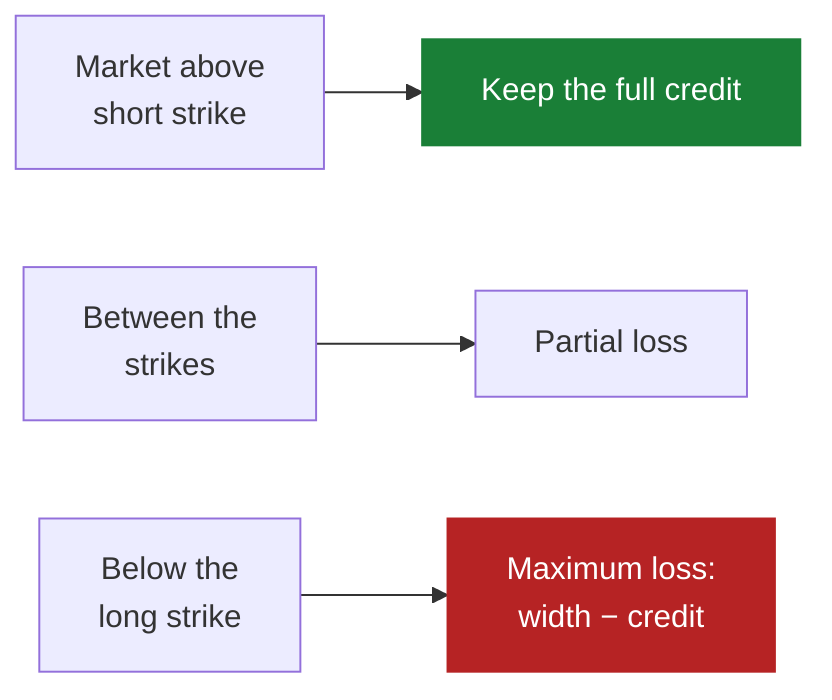

# Selling options

*Level 6 — strategy families. The only family here that is not a bet on
direction.*

## The claim

> People pay more for protection than it turns out to be worth, so selling it is
> profitable on average.

An option is a contract, and someone buying a put is buying insurance against a
fall. Like all insurance it is usually priced above its expected cost, because the
buyer is paying for certainty and the seller is being paid to carry uncertainty.
Selling it collects that premium.

Arvo's rule is a **put credit spread**: sell a put near a chosen probability of
finishing in the money, and simultaneously buy a cheaper one a fixed distance
below. You collect the difference in premium as a credit. The bought put is what
turns an open-ended risk into a known one.

| | |
|---|---|
| **You collect** | the credit, up front |
| **Your best case** | keep all of it — the market stays above your short strike |
| **Your worst case** | the width between the strikes, minus the credit |
| **You want** | the market to go up, sideways, or down *slowly* |

Three of four outcomes pay you. That is the attraction, and it is also the trap.

## Why anyone believes it

**The variance risk premium is real and measured.** Implied volatility — what
options are priced at — has historically exceeded the volatility that subsequently
occurred, persistently, across decades. Sellers were paid for that gap. This is one
of the better-documented premia in markets.

**The buyers are not stupid, they are hedging.** A fund with a mandate to limit
losses buys puts whether or not they are good value. That is a structural,
price-insensitive bid, and it is what you are selling into. You are being paid to
absorb someone else's constraint.

**Time is on your side.** An option loses value as expiry approaches, all else
equal. A seller's position improves by doing nothing, which is the only family here
of which that is true.

!!! note "Say the cost"
    The premium is compensation for a real risk, not a market inefficiency. You are
    being paid *because* the bad outcome is genuinely bad. Every so often it happens,
    and it arrives as one large loss across every position at once — because the
    thing that causes it is the thing that correlates everything. The long-run
    average is positive and the path includes days that end accounts.

## What it looks like

A payoff that is flat and positive over most of the range, then falls off a cliff:



`put_spread` takes these, and the shipped ruleset searches only the first two:

| Parameter | Means |
|---|---|
| `short_delta` | roughly the probability the short put finishes in the money. 0.20 means about a one-in-five chance |
| `dte` | days to expiry when the spread is opened |
| `width` | the strike distance in dollars, which sets the maximum loss |
| `take_profit` | the fraction of the credit at which to close early |
| `exit_dte` | close with this many days left, regardless |
| `rate`, `dividend_yield` | stated, not implied — inputs to pricing rather than things to search |

Note `take_profit` and `exit_dte`: a seller's two exits are "most of the money has
been made" and "the remaining time is not worth the remaining risk". Holding a
credit spread to expiry for the last few cents is the worst risk-reward in the trade.

## When it fails

**A fast fall through both strikes.** Your loss maxes out and there is nothing to
manage. This is the designed worst case and it is fine — if you sized for it.

**Correlation arrives with the loss.** Ten spreads on ten underlyings lose together,
because a market-wide fall is what causes any of them to lose. The
`correlation_cap` in Arvo's risk model exists for exactly this, and it **refuses
when the correlation is unknown** rather than assuming it away.

**The win rate seduces you into sizing up.** Eighty percent of trades paying in full
is a powerful sequence of small confirmations. It is also the shape that makes
traders raise size right before the loss that needed them not to. Go back to [the
expectancy table](../entries-and-exits.md): a 4:1 loss-to-win ratio at an 80% win
rate is break-even before costs.

**Volatility expansion hurts before price does.** A spread can be deep underwater on
a mark while price is still above your short strike, because what you are short got
more expensive. If your sizing cannot tolerate that, you will close at the worst
moment.

## Test it

This family has a hard limit that no amount of patience removes:

!!! warning "Option history cannot be backfilled"
    **No vendor serves an option quote after the fact.** A chain that was not
    recorded on the day is gone forever. What Arvo has recorded is the entire
    universe of what the option rules can ever be studied on — the list is
    `option-quotes/underlyings.json` in the project, chosen for liquidity and said
    out loud, never for what the underlyings returned. The engine records each one's
    chain every fifteen minutes of the regular session. Which means: **you cannot
    run a ten-year study here.** You can study what you have recorded, starting from
    when you started recording.

Once you have chains, `rulesets/credit.json`:

```json
{
  "name": "credit",
  "label": "SPY put spreads",
  "premise": "Selling a put a month out near a fifth delta keeps enough credit to pay for the falls.",
  "interval": { "step": 1, "unit": "day" },
  "kind": {
    "kind": "grid",
    "rule": "put_spread",
    "fixed": {
      "trade_size": 100.0,
      "width": 5.0,
      "take_profit": 0.5,
      "exit_dte": 21.0,
      "rate": 0.04,
      "dividend_yield": 0.013
    },
    "axes": { "short_delta": [0.15, 0.20, 0.30], "dte": [30.0, 45.0] }
  }
}
```

Six configurations. Everything but delta and expiry is pinned, deliberately: every
axis is a trial that deflation counts, and this family has the least history to
spend on a wide search.

What to read:

1. **How much history you actually have.** Before the verdict, before anything — a
   few months of recorded chains cannot answer a question about a strategy whose
   risk shows up once every few years. Expect `Inconclusive` and understand that it
   is correct.
2. **The worst single trade.** The average tells you nothing about this payoff shape.
   Find the largest loss on the Trades tab and multiply it by the positions you would
   have held simultaneously.
3. **Whether the window contained a fall.** If your recorded history has no sharp
   drawdown in it, you have measured the good half of the distribution only. Say so
   out loud when you interpret the result.
4. **The sizing.** The gate sizes this by the cash the worst case needs. A standard
   option contract is a lot of a hundred units of the deliverable, and a proposal for
   two and a half contracts is refused as `NotWholeLot` rather than rounded.

## Watch

<!-- TODO: curate. Channel name and year beside each link. -->

- *(to be chosen)* — how a credit spread's payoff is built from two options.
- *(to be chosen)* — the variance risk premium, and what sellers are paid for.

## Next

[Why a backtest lies](../backtest-lies.md) — level 7, and the one that changes how
you read everything above.
