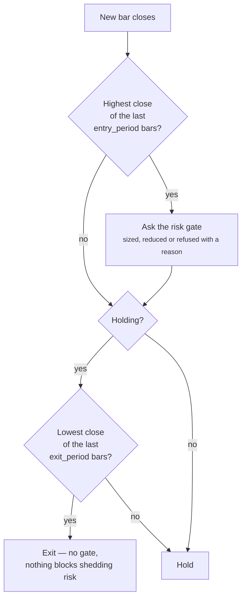

# Trend following

*Level 6 — strategy families. Assumes [market types](../market-types.md) (level 3) and
[risk and sizing](../risk-and-sizing.md) (level 5).*

## The claim

> What has been going up tends to keep going up for long enough to pay for the
> times it doesn't.

Not "prices go up". The claim is about *persistence*: that a move already
underway is more likely to continue than to reverse, by a margin wide enough to
cover the losses from every move that reversed immediately.

That last clause is the whole strategy. A trend follower is usually wrong.

## Why anyone believes it

Three mechanisms, none of them mystical, and they matter because a claim with a
mechanism can be argued about while a claim with only a backtest cannot.

**Information spreads slowly.** A fact that changes what a company is worth
does not reach every holder at once. Large holders cannot move quickly without
moving the price against themselves, so they move over days or weeks, and that
leaves a drift in one direction rather than a jump.

**Someone has to be paid to take the other side.** A person who wants out of a
falling position needs a buyer. That buyer takes on risk and is compensated by
price. This is a transfer, not an inefficiency, which is why it is harder to
arbitrage away than a mispricing.

**People buy what is going up.** Money follows returns, and inflows buy more of
what already rose. This one is the least respectable and the most reliably
present.

!!! note "Say the cost"
    Every one of those mechanisms is weaker now than it was in 1990. Faster
    information, cheaper execution and a crowded trade all cut the same margin.
    Trend following is the best-documented edge in public markets *and* one
    whose returns have measurably thinned. Both halves are true.

## What it looks like

On a chart: a series of higher highs and higher lows, with pullbacks that stop
short of the previous low. The eye is good at seeing this and bad at seeing how
often it appeared and then failed — which is the reason this page ends in a
study rather than a picture.

As logic, a trend follower is a *channel* rule. `momentum_breakout` is the one
Arvo ships:



Two numbers decide everything: how much strength you need to get in
(`entry_period`) and how much weakness you accept before getting out
(`exit_period`).

!!! tip "Arvo refuses one shape of this rule outright"
    If you set `exit_period` above `entry_period`, the engine rejects it:

    > *exit period 60 must not exceed entry period 40; a rule that needs more
    > evidence to leave than to enter gives most of a trend back before it
    > admits the trend ended*

    A rule that is quick to buy and slow to sell is the most common beginner
    shape, because it feels patient. It is not patient, it is asymmetric in the
    wrong direction.

## When it fails

**It needs a trending regime.** Arvo labels every trade *trending up*,
*trending down* or *ranging*, so you can ask the question directly rather than
guess: did this only work in one regime? A trend follower in a ranging market
buys every false start and sells every false end, and pays the spread each time.

**Most trades lose.** A working trend follower wins maybe a third of its
trades. The wins are much larger than the losses — which means the result rests
on a handful of trades, and a handful is not a sample. This is why the verdict
you get will often be `Inconclusive` rather than `NotSupported`: Arvo is
telling you there is not enough evidence to separate skill from luck, which is
a different statement from "it doesn't work".

**The exit gives back the end of every trend.** By construction, you leave
after the reversal is visible. There is no version of this rule that exits at
the top, and a backtest that appears to is a bug or a lookahead.

**Costs bite twice.** Trend rules trade often and enter on strength, which is
when spreads widen. Arvo re-runs every finding with costs raised — half again
the commission, twice the slippage — and ranks by what survived
[conservative](../../glossary.md) costs first. Trend rules move down that
leaderboard more than most.

## Test it

Write `rulesets/channel.json` in your project:

```json
{
  "name": "channel",
  "label": "Channel breakout",
  "premise": "A close at a 40 to 60 day high continues for long enough to pay for the false starts.",
  "interval": { "step": 1, "unit": "day" },
  "kind": {
    "kind": "grid",
    "rule": "momentum_breakout",
    "fixed": { "trade_size": 10.0 },
    "axes": { "entry_period": [40.0, 60.0], "exit_period": [10.0, 20.0] }
  }
}
```

Then Research view → pick `channel` → pick an instrument with bars → **Run**.
Full steps in [run a study](../../how-to/run-a-study.md).

Four configurations, so the winner is judged as the best of four, not as a
single guess. That is
[deflation](../../concepts/trading.md#deflation), and it is why the grid is small:
every value you add raises the bar the winner has to clear.

Compare it against the control — `sma_cross` is in Arvo as a rule nobody
disputes, not as a good idea:

```python
import arvo

engine = arvo.connect()
found = engine.run_study("AAPL.RH", "sma_cross", author="script:trend-lesson")
print(found.verdict, found.read_this_first)
```

### What to read, and in what order

1. **The verdict**, then **the advice** — before any number. If an advice item
   is `blocking`, the numbers below it are not a result yet.
2. **The trade count.** Under about thirty round trips, stop reading. A trend
   rule on two years of daily bars often lands here, and the fix is a longer
   window, not a looser entry.
3. **The regime split** on the Trades tab. If every winning trade is labelled
   *trending up*, you have learned something real and narrow: you have a rule
   that needs a regime, and you have no evidence about when that regime returns.
4. **Against the benchmark.** Holding the instrument is the bar. Check the
   dividend gap beside it — on a two-year test of a dividend payer, the gap can
   be most of your apparent margin.

!!! note "Expect Inconclusive"
    On one instrument over a couple of years this rule will usually not produce
    enough trades to say anything. That is the lesson, not a failure of the
    test. The honest routes to a real answer are a longer window, or a
    [panel](../../concepts/trading.md#panel) — the same configuration over many
    instruments, which pools evidence instead of lowering the bar.

## Watch

<!-- TODO: curate. Put channel name and year beside each link so a dead link is
     visibly dead, and re-check these when this page is next edited. -->

- *(to be chosen)* — what a trend looks like as it forms, in motion rather than
  in hindsight.
- *(to be chosen)* — why a low win rate can still be profitable, worked through
  with numbers.

## Next

[Mean reversion](mean-reversion.md) — the opposite claim, which is also true, in
different conditions. Then [why a backtest lies](../backtest-lies.md) (level 7), which is
where the two get separated from wishful thinking.
