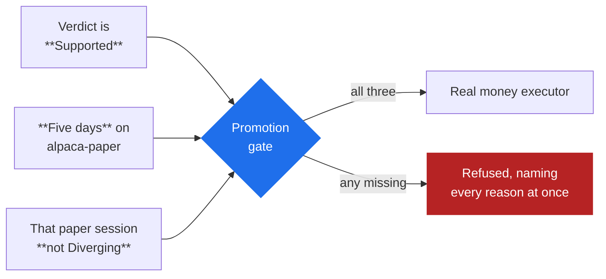

# Paper to real money

*Level 9. Assumes [reading a verdict](reading-a-verdict.md).*

## The idea

A backtest assumes. A paper session **measures**. That difference is the entire
point of this level, and it is why paper trading in Arvo is a measurement rather
than a rehearsal.

Your backtest assumed a fill price, assumed every order filled, and assumed a
latency of zero. A paper session finds out. What it finds out is called
**divergence**: the measured difference between what the backtest assumed and what
the venue actually did.

## What paper trading measures

| Measured | Against |
|---|---|
| **Slippage** — mean and worst adverse, in basis points across fills | the slippage the finding's cost model assumed |
| **Latency** — mean signal-to-fill time | the backtest's implicit zero |
| **Unfilled orders** — approved orders that never filled | a backtest, which assumes every order fills |
| **Trade frequency** | how often the rule fired in the window |
| **Expectancy per trade** | the out-of-sample trade distribution |
| **Regimes entered** | the regimes the finding's trades landed in |

Unfilled orders are never averaged into the slippage figure, and that is the right
choice: an order that did not fill is not a bad fill, it is a trade you did not get,
and mixing the two hides both.

## What paper trading cannot measure

Three things, and each one is a real gap rather than a rounding error.

**Your own market impact.** Paper fills do not consume liquidity. In a liquid large
company at small size this is negligible. In anything thin, or at size, your real
orders move the price you are trying to get, and no paper session will tell you by
how much.

**Queue position.** A paper limit order at the bid is assumed to fill when the price
trades there. A real one sits behind everyone who got there first, and on a fast move
the price can trade through your level without ever reaching you.

**What you will do.** The hardest one. A paper drawdown and a real drawdown of the
same percentage are not the same experience, and the difference decides whether you
follow the rule. Nothing in Arvo can test this and no honest system claims to.

!!! note "Say the cost"
    Paper trading closes the gap between a backtest and reality substantially, and
    it does not close it completely. Five days of paper is a filter against obvious
    breakage, not proof. Treat it as the cheapest available evidence rather than the
    last piece of it.

## The promotion gate

Arvo does not let a finding reach real money because you feel ready. A session on
`alpaca-live` or a Robinhood account is **refused at start** unless all three hold:



Details that matter:

- The refusal **names every reason at once**, so they can be fixed together rather
  than discovered one at a time.
- The gate is **in the engine**, on the start itself — so the command line, the
  window and an agent are all held to it. Nothing else creates a session.
- **Paper needs no promotion.** The gate is only in front of real money.
- The Sessions tab shows the road under the form as soon as a finding and an
  executor are chosen: the verdict, the days on paper, the paper session's verdict,
  and either the reasons it refuses or that it allows. The button reads **Promote**
  and stays disabled while the gate refuses.

## What a live session does that a backtest does not

**It audits its own book.** Every poll, the session compares its book against the
venue's. On a disagreement it **freezes**: it stops taking entries and waits for a
person, rather than trading on a position it is not sure it holds.

A disagreement is not a bug, it is an event with real causes — a fill the process
never heard, a hand-placed order, a broker-side liquidation. So:

| State | Means |
|---|---|
| `running` | polling or streaming, taking entries |
| `frozen` | entries wait for a person; **exits still go**. Either the book disagrees with the venue, or the feed has gone dark |
| `halted` | the gate stopped the account: the drawdown halt, or the kill switch |
| `stopped` | asked to stop; positions left as they are |

**Reconcile** makes the gate's book the venue's — the venue holds the money.
**Resume** takes entries again and is refused until a reconcile has happened. Both
are events on the record. **Nothing resumes on its own.**

**It refuses yesterday's signals.** A session started after the open catches up on
the bars it missed: the rule is warmed on them and their signals go on the record,
but an entry from a bar that closed before the session started is refused
(`catch-up: …`) and never sent. Yesterday's signal at today's market is not the
trade the finding measured. Exits still go.

**It comes up halted if it inherits positions.** A session starting against an
account already holding positions adopts them and comes up **halted**, naming what it
found, until you look. A limit that a restart lifts is not a limit.

## The kill switch

**Halt** arms the gate and *then* flattens everything the session holds, in that
order — so a proposer racing in is refused rather than opening into the exit. What
the venue would not exit is named in the record and on the status, and the halt
stands either way.

Available from a session's row, the Operations view, the tray (**Halt trading**,
every session) and the command line:

```sh
arvo-engine ~/arvo session halt --all "spread blew out"
```

The drawdown halt is permanent for the run. The kill switch lifts only when a person
releases it.

## What people get wrong

**Treating five days as a waiting period to be endured.** It is a measurement. Read
the divergence figures at the end of it — if your measured slippage is twice what the
cost model assumed, the finding's edge may already be gone, and the `execution`
divergence reason will say so.

**Going live on a Diverging paper session by starting a fresh one.** The gate reads
the paper session's record, so this does not work, and it is worth knowing that the
attempt was anticipated.

**Confusing a freeze with a halt.** A freeze is a session that is unsure of its
position and wants a person. A halt is the gate protecting the account. Different
causes, different fixes, and only one of them is about your money running out.

**Sizing real money like paper money.** The one thing paper cannot teach is what a
drawdown feels like when it is real. Start smaller than the backtest justifies.

## Try it

1. Take a finding with a `Supported` verdict and start a session on
   `alpaca-paper`. Paper needs no promotion, so this works immediately.
2. Let it run. Check `session list` or the Sessions tab for the divergence figures
   once anything has filled.
3. Compare measured slippage against what the cost model assumed. That single
   comparison is the most valuable number in this whole section.
4. Try to start the same finding on a real-money executor before five days have
   passed, and read the refusal. It will name every reason at once.

## Watch

<!-- TODO: curate. Channel name and year beside each link. -->

- *(to be chosen)* — slippage and market impact demonstrated on real orders.
- *(to be chosen)* — why paper trading results overstate live results.

## Next

[What moves the market](what-moves-markets.md) — the last level, and the only one
Arvo cannot test for you.
