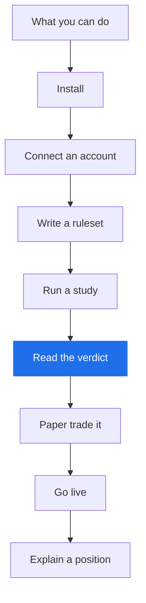
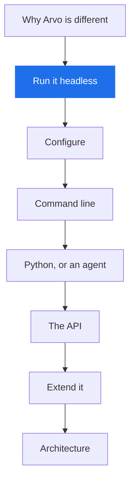

# Where to start

Two routes. Pick the one that matches why you're here; they meet in the middle.

## "I want to test and trade my ideas"

You have a strategy, or an idea for one, and you want to know whether it survives
honest testing before it sees money.

| | |
|---|---|
| 1 | [What you can do with Arvo](what-you-can-do.md) — the seven things it's for |
| 2 | [Install](../getting-started/install.md) the window and the engine |
| 3 | [Connect an account](../getting-started/accounts.md) — Alpaca for bars and paper trading |
| 4 | [Write a ruleset](../how-to/write-a-ruleset.md) — your idea, and the parameters to try |
| 5 | [Run a study and read the verdict](../how-to/run-a-study.md) — **the step that matters** |
| 6 | [Start a paper session](../how-to/paper-session.md) on a finding that passed |
| 7 | [When a session freezes](../how-to/frozen-session.md) and [halt trading](../how-to/halt.md) |
| 8 | [Explain a position](../how-to/explain.md) — why do I own this? |

**The one page to read properly** is step 5. Everything else is mechanics; that
page is where you learn to read what Arvo is telling you, including when it tells
you it doesn't know.

## "I want to build on it"

You want to drive Arvo from code, an editor or an agent — or extend it.

| | |
|---|---|
| 1 | [Why Arvo is different](../concepts/index.md) — the thesis the code is built around |
| 2 | [The engine on its own](../engine/index.md) — no window needed; it's a complete tool |
| 3 | [Configure](../engine/configure.md) — the project folder, the handshake, the two tokens |
| 4 | [Command line](../engine/cli.md) and [engine examples](../engine/examples.md) |
| 5 | [Research from Python](../how-to/python.md), or [with Claude Code](../engine/claude.md) |
| 6 | [The API and the packages](../reference/api.md) |
| 7 | [Extensions](../extend/extensions.md) and [writing a provider](../extend/providers.md) |
| 8 | [Architecture](../about/architecture.md) and the [decisions](../about/decisions.md) behind it |

**The one thing to understand early** is the two-token split in step 3: an agent
or a script holds a token that reaches research and nothing else, so it cannot
place an order or touch a credential. Most of the design follows from that.

## Where they meet

Both paths need the same three ideas, and they're in [Core
concepts](../concepts/trading.md): what a **rule** and a **ruleset** are, what makes a result
**out-of-sample**, and why the number of things you tried changes what the winner
has to beat.

If you read nothing else, read [Why Arvo is
different](../concepts/index.md) — it's short, and it's the reason the rest is
shaped this way.
